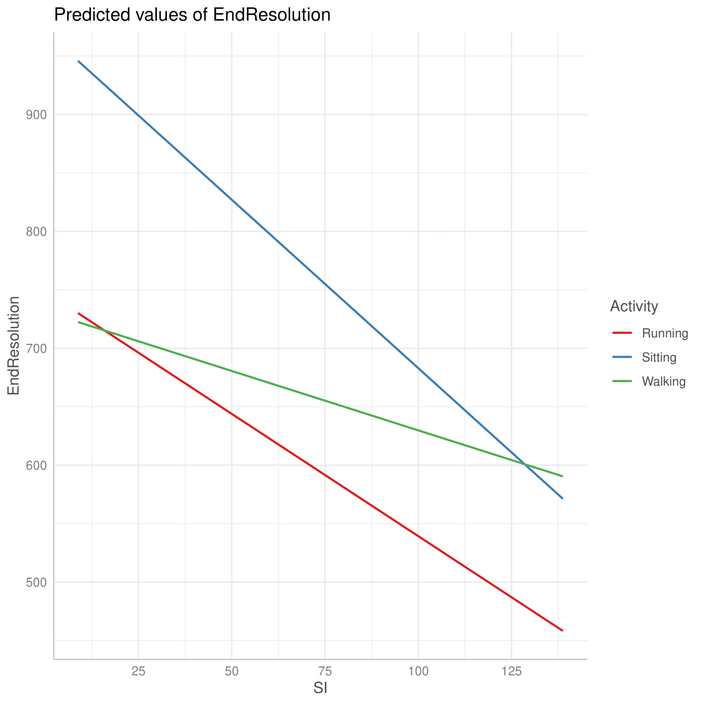
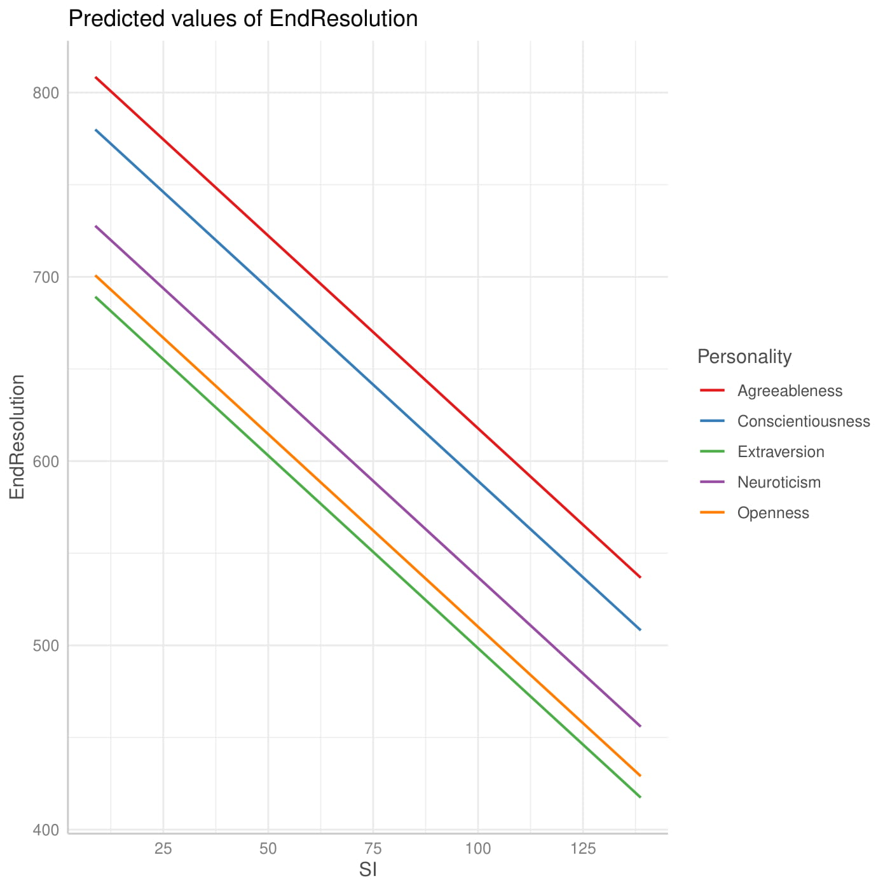
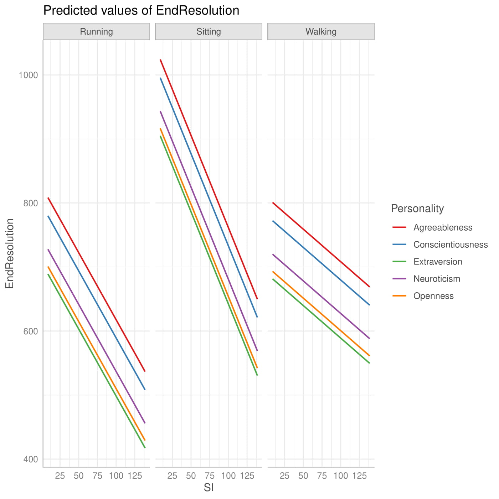
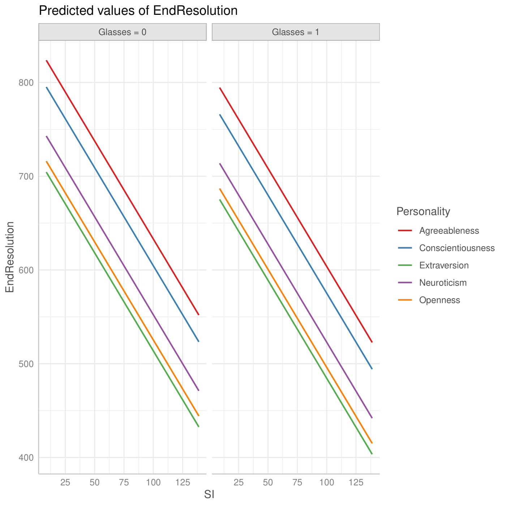
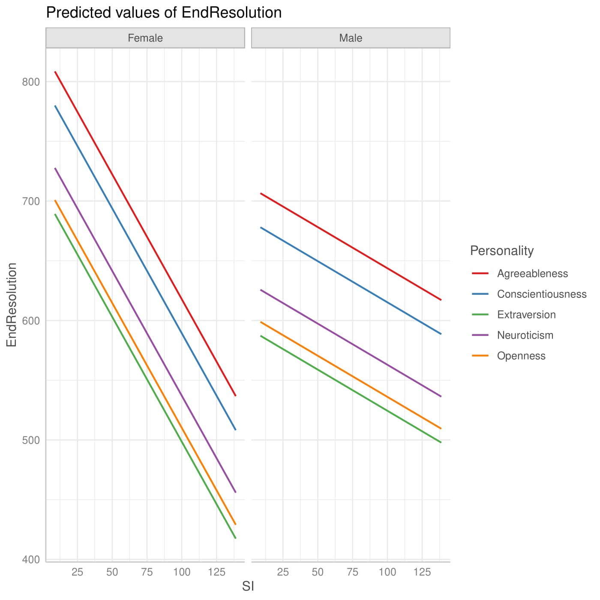
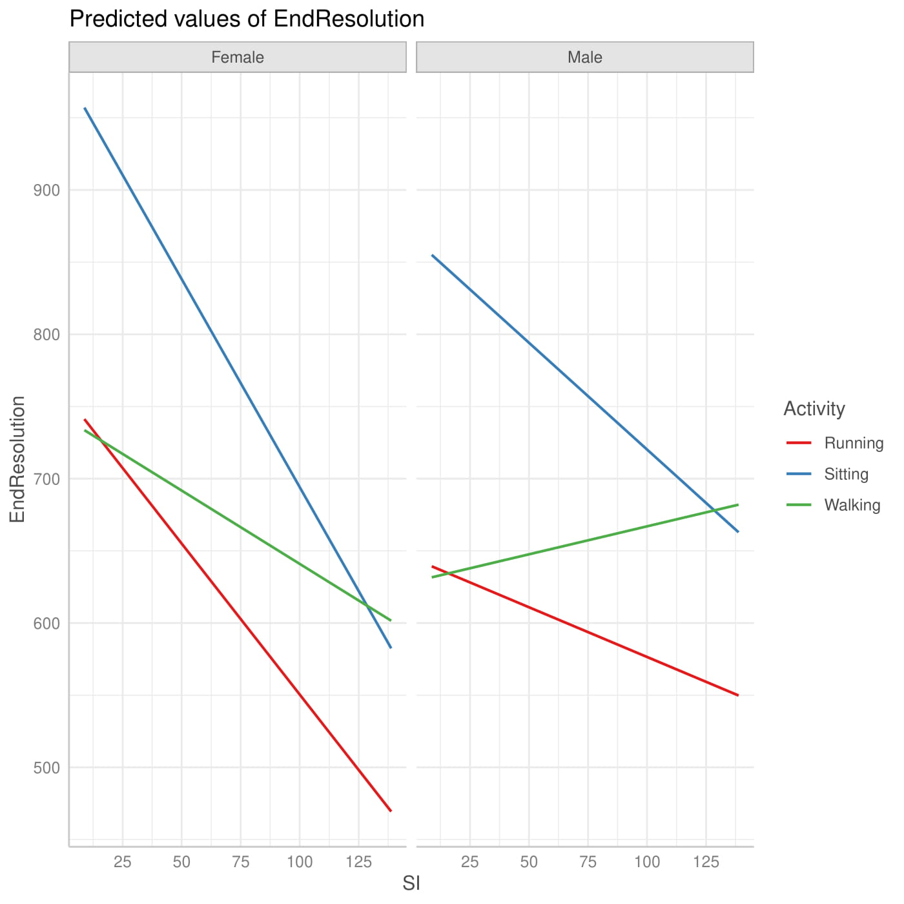
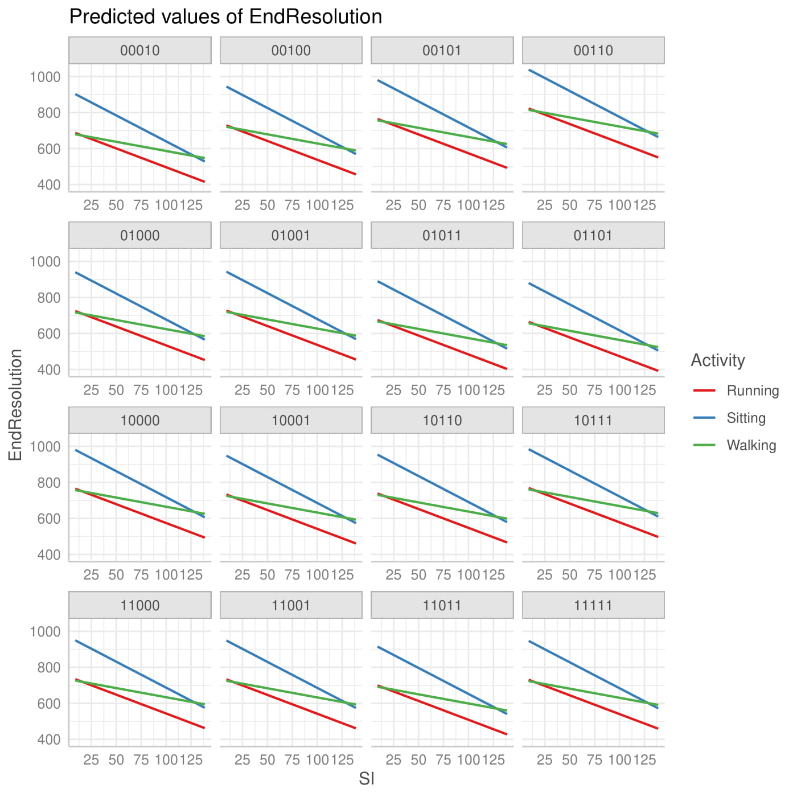
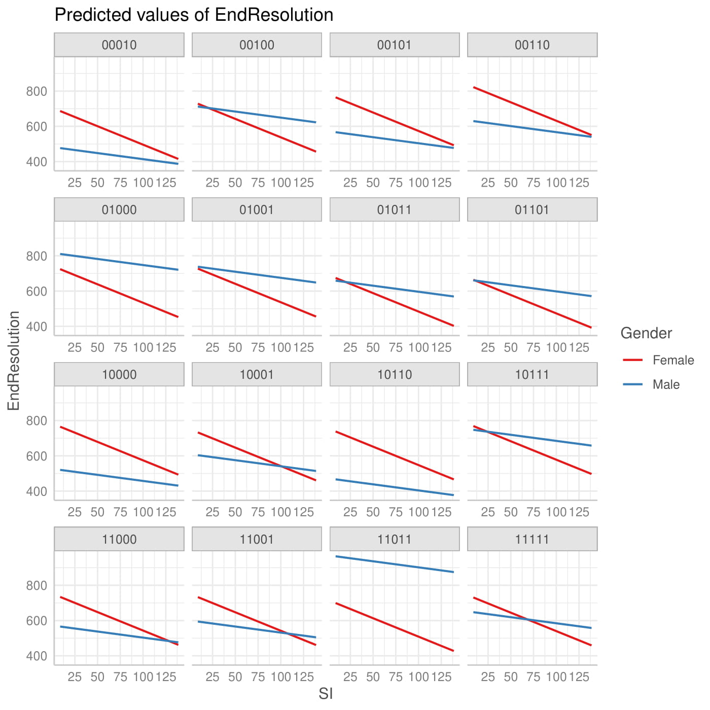
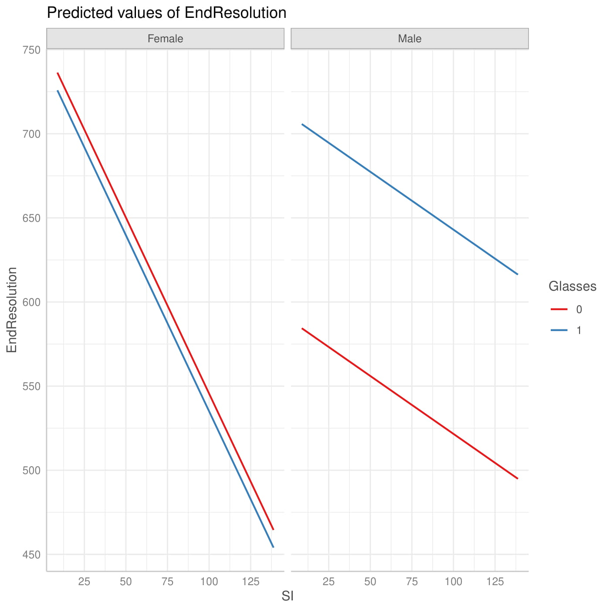

## 1. Attaching libraries and loading data

```R
library('lme4')
    
    Loading required package: Matrix

library('lmerTest')

    Attaching package: ‘lmerTest’

    The following object is masked from ‘package:lme4’:

        lmer

    The following object is masked from ‘package:stats’:

        step

library(MuMIn)
library(ggeffects)
library(ggplot2)

classes <- c(rep("numeric", 3), "character", rep("numeric", 2), rep("character", 2), rep("numeric", 2), "character", "numeric")

d <- read.csv('test.csv', colClasses=classes)
```

## 2. Data structure preview

```R
str(d)

    'data.frame':   264 obs. of  12 variables:
    $ ExperimentID   : num  1 1 1 1 1 1 1 1 1 1 ...
    $ UserID         : num  111 111 111 111 111 111 111 111 111 111 ...
    $ VideoID        : num  11 12 13 14 21 22 23 24 31 32 ...
    $ Activity       : chr  "Sitting" "Sitting" "Sitting" "Sitting" ...
    $ StartResolution: num  360 360 360 360 360 360 360 360 360 360 ...
    $ EndResolution  : num  720 480 720 720 720 480 480 480 360 480 ...
    $ Gender         : chr  "Male" "Male" "Male" "Male" ...
    $ Personality    : chr  "Neuroticism" "Neuroticism" "Neuroticism" "Neuroticism" ...
    $ SI             : num  8.78 38.86 138.69 136.5 14.34 ...
    $ TI             : num  3.69 36.95 8.3 28.59 3.49 ...
    $ Cluster        : chr  "00010" "00010" "00010" "00010" ...
    $ Glasses        : num  1 1 1 1 1 1 1 1 1 1 ...
```

## 3. Null model (grouping by UserID)
```R
mu_null <- lmer(EndResolution ~ 1 + (1 | UserID), data=d)

summary(mu_null)
Formula: EndResolution ~ 1 + (1 | UserID)
   Data: d

REML criterion at convergence: 3759.6

Scaled residuals: 
    Min      1Q  Median      3Q     Max 
-1.9871 -0.7182 -0.2625  0.5857  2.4260 

Random effects:
 Groups   Name        Variance Std.Dev.
 UserID   (Intercept) 14977    122.4   
 Residual             43575    208.7   
Number of obs: 276, groups:  UserID, 23

Fixed effects:
            Estimate Std. Error     df t value Pr(>|t|)    
(Intercept)   670.87      28.44  22.00   23.59   <2e-16 ***
```
| Variable | R2m | R2c    | ICC   | AIC    | BIC  | Formula          |
| -------- | --- | ------ | ----- | ------ | ---- | ---------------- |
| mu\_null | 0   | 0.2558 | 0.346 | 3774.1 | 3785 | 1 + (1 \| UserID) |

### 3.1 Adding Activity, SI, TI, Personality, Gender, Glasses
```R
mu1 <- lmer(1 + Activity + (1 | UserID), data=d)
mu2 <- lmer(1 + SI + (1 | UserID), data=d)
mu3 <- lmer(1 + TI + (1 | UserID), data=d)
mu4 <- lmer(1 + Personality + (1 | UserID), data=d)
mu5 <- lmer(1 + Gender + (1 | UserID), data=d)
mu6 <- lmer(1 + Glasses + (1 | UserID), data=d)

#take mu2 as a starting point for next iteration
summary(mu2)
Formula: EndResolution ~ 1 + SI + (1 | UserID)
   Data: d

REML criterion at convergence: 3727.9

Scaled residuals: 
    Min      1Q  Median      3Q     Max 
-2.1071 -0.7363 -0.1095  0.6189  2.4912 

Random effects:
 Groups   Name        Variance Std.Dev.
 UserID   (Intercept) 15406    124.1   
 Residual             38429    196.0   
Number of obs: 276, groups:  UserID, 23

Fixed effects:
            Estimate Std. Error       df t value Pr(>|t|)    
(Intercept) 780.9039    34.0034  44.2210  22.965  < 2e-16 ***
SI           -1.3795     0.2336 252.0000  -5.905 1.13e-08 ***
```
| Variable | R2m   | R2c    | ICC   | AIC    | BIC    | Formula                        |
| -------- | ----- | ------ | ----- | ------ | ------ | ------------------------------ |
| mu1      | 0.781 | 0.339  | 0.283 | 3747.3 | 3765.4 | 1 + Activity + (1 \| UserID)    |
| mu2      | 0.083 | 0.345  | 0.286 | 3743.3 | 3757.8 | 1 + SI + (1 \| UserID)          |
| mu3      | 0.005 | 0.2606 | 0.257 | 3774.2 | 3788.6 | 1 + TI + (1 \| UserID)          |
| mu4      | 0.064 | 0.293  | 0.244 | 3776.4 | 3801.7 | 1 + Personality + (1 \| UserID) |
| mu5      | 0.003 | 0.267  | 0.264 | 3775.9 | 3790.3 | 1 + Gender + (1 \| UserID)      |
| mu6      | 0.017 | 0.266  | 0.253 | 3774.7 | 3789.2 | 1 + Glasses + (1 \| UserID)     |

### 3.2 Expanding mu2 with Activity
```R
mu7 <- lmer(EndResolution ~ 1 + SI + Activity + (1 | UserID), data=d)
mu8 <- lmer(EndResolution ~ 1 + SI * Activity + (1 | UserID), data=d)

#mu8 has better scores
summary(mu8)
Formula: EndResolution ~ 1 + SI * Activity + (1 | UserID)
   Data: d

REML criterion at convergence: 3665

Scaled residuals: 
    Min      1Q  Median      3Q     Max 
-2.5269 -0.6265 -0.1762  0.7499  2.4855 

Random effects:
 Groups   Name        Variance Std.Dev.
 UserID   (Intercept) 15891    126.1   
 Residual             32602    180.6   
Number of obs: 276, groups:  UserID, 23

Fixed effects:
                   Estimate Std. Error       df t value Pr(>|t|)    
(Intercept)        701.0992    48.0510 137.3122  14.591  < 2e-16 ***
SI                  -1.2985     0.4138 248.0000  -3.138  0.00191 ** 
ActivitySitting    222.7017    51.5886 248.0000   4.317 2.29e-05 ***
ActivityWalking    -17.0845    53.3322 248.0000  -0.320  0.74898    
SI:ActivitySitting  -0.7904     0.5264 248.0000  -1.502  0.13448    
SI:ActivityWalking   1.0758     0.5799 248.0000   1.855  0.06478 .
```
| Variable | R2m   | R2c   | ICC   | AIC    | BIC    | Formula                           |
| -------- | ----- | ----- | ----- | ------ | ------ | --------------------------------- |
| mu2      | 0.083 | 0.345 | 0.286 | 3743.3 | 3757.8 | 1 + SI + (1 \| UserID) |
| mu7      | 0.155 | 0.423 | 0.317 | 3714.5 | 3736.2 | 1 + SI + Activity + (1 \| UserID)  |
| mu8      | 0.181 | 0.449 | 0.328 | 3705.7 | 3734.6 | 1 + SI \* Activity + (1 \| UserID) |

### 3.3 Expanding mu8 with SI*Gender
```R
mu9 <- lmer(EndResolution ~ 1 + SI * Activity + SI * Gender + (1 | UserID), data=d)

summary(mu9)
Formula: EndResolution ~ 1 + SI * Activity + SI * Gender + (1 | UserID)
   Data: d

REML criterion at convergence: 3644

Scaled residuals: 
    Min      1Q  Median      3Q     Max 
-2.4433 -0.7334 -0.1371  0.6924  2.4297 

Random effects:
 Groups   Name        Variance Std.Dev.
 UserID   (Intercept) 16669    129.1   
 Residual             31355    177.1   
Number of obs: 276, groups:  UserID, 23

Fixed effects:
                   Estimate Std. Error       df t value Pr(>|t|)    
(Intercept)        748.4774    61.1469  73.4521  12.241  < 2e-16 ***
SI                  -2.0914     0.4718 247.0000  -4.433  1.4e-05 ***
ActivitySitting    222.7017    50.5924 247.0000   4.402  1.6e-05 ***
ActivityWalking    -17.0845    52.3023 247.0000  -0.327  0.74421    
GenderMale         -83.8229    67.5585  37.2272  -1.241  0.22246    
SI:ActivitySitting  -0.7904     0.5162 247.0000  -1.531  0.12701    
SI:ActivityWalking   1.0758     0.5687 247.0000   1.892  0.05972 .  
SI:GenderMale        1.4029     0.4256 247.0000   3.296  0.00113 **
```
| Variable | R2m   | R2c   | ICC   | AIC    | BIC    | Formula                                          |
| -------- | ----- | ----- | ----- | ------ | ------ | ------------------------------------------------ |
| mu8      | 0.181 | 0.449 | 0.328 | 3705.7 | 3734.6 | 1 + SI \* Activity + (1 \| UserID)                |
| mu9      | 0.202 | 0.479 | 0.347 | 3698.5 | 3734.7 | 1 + SI \* Activity + SI \* Gender + (1 \| UserID) |

### 3.4 Final model (adding Gender as  a random effect to mu9)
```R
mu10 <- lmer(EndResolution ~ 1 + SI * Activity + SI * Gender + (Gender | UserID), data=d)

summary(mu10)
Formula: EndResolution ~ 1 + SI * Activity + SI * Gender + (Gender | UserID)
   Data: d

REML criterion at convergence: 3638.9

Scaled residuals: 
     Min       1Q   Median       3Q      Max 
-2.43225 -0.70761 -0.08719  0.66506  2.50035 

Random effects:
 Groups   Name        Variance Std.Dev. Corr 
 UserID   (Intercept)  3704     60.86        
          GenderMale  25293    159.04   -0.13
 Residual             31355    177.07        
Number of obs: 276, groups:  UserID, 23

Fixed effects:
                   Estimate Std. Error       df t value Pr(>|t|)    
(Intercept)        748.4774    49.4205 103.5499  15.145  < 2e-16 ***
SI                  -2.0914     0.4718 247.0000  -4.433  1.4e-05 ***
ActivitySitting    222.7017    50.5924 247.0000   4.402  1.6e-05 ***
ActivityWalking    -17.0845    52.3023 247.0000  -0.327  0.74421    
GenderMale         -83.8229    63.3689  34.7077  -1.323  0.19456    
SI:ActivitySitting  -0.7904     0.5162 247.0000  -1.531  0.12701    
SI:ActivityWalking   1.0758     0.5687 247.0000   1.892  0.05972 .  
SI:GenderMale        1.4029     0.4256 247.0000   3.296  0.00113 **
```
| Variable | R2m   | R2c    | ICC   | AIC    | BIC    | Formula                                               |
| -------- | ----- | ------ | ----- | ------ | ------ | ----------------------------------------------------- |
| mu9      | 0.202 | 0.479  | 0.347 | 3698.5 | 3734.7 | 1 + SI \* Activity + SI \* Gender + (1 \| UserID)      |
| mu10     | 0.202 | 0.4774 | 0.48  | 3696.7 | 3740.1 | 1 + SI \* Activity + SI \* Gender + (Gender \| UserID) |

### 3.5 Visualization



## 4. Null model (grouping by dominant Personality)
```R
mp_null <- lmer(EndResolution ~ 1 + (1 | UserID), data=d)

summary(mp_null)
Formula: EndResolution ~ 1 + (1 | Personality)
   Data: d

REML criterion at convergence: 3792.2

Scaled residuals: 
    Min      1Q  Median      3Q     Max 
-1.6686 -0.7631 -0.1297  0.4999  2.0387 

Random effects:
 Groups      Name        Variance Std.Dev.
 Personality (Intercept)  3948     62.84  
 Residual                54727    233.94  
Number of obs: 276, groups:  Personality, 5

Fixed effects:
            Estimate Std. Error      df t value Pr(>|t|)    
(Intercept)  665.603     32.543   4.255   20.45 2.07e-05 ***
```
| Variable | R2m | R2c   | ICC   | AIC    | BIC    | Formula               |
| -------- | --- | ----- | ----- | ------ | ------ | --------------------- |
| mp\_null | 0   | 0.067 | 0.068 | 3806.8 | 3817.7 | 1 + (1 \| Personality) |

### 4.1 Adding Activity, SI, TI, Personality, Gender, Glasses
```R
mp1 <- lmer(EndResolution ~ 1 + Activity + (1 | Personality), data=d) 
mp2 <- lmer(EndResolution ~ 1 + SI + (1 | Personality), data=d)
mp3 <- lmer(EndResolution 1 + TI + (1 | Personality)~ , data=d)
mp4 <- lmer(EndResolution ~ 1 + Personality + (1 | Personality), data=d) #failed to converge
mp5 <- lmer(EndResolution ~ 1 + Gender + (1 | Personality), data=d)
mp6 <- lmer(EndResolution ~ 1 + Glasses + (1 | Personality), data=d)  

#take mp2 as a starting point for next iteration
summary(mp2)
Formula: EndResolution ~ 1 + SI + (1 | Personality)
   Data: d

REML criterion at convergence: 3767.3

Scaled residuals: 
    Min      1Q  Median      3Q     Max 
-2.0046 -0.7965 -0.1713  0.6289  2.3799 

Random effects:
 Groups      Name        Variance Std.Dev.
 Personality (Intercept)  4002     63.26  
 Residual                49976    223.55  
Number of obs: 276, groups:  Personality, 5

Fixed effects:
            Estimate Std. Error       df t value Pr(>|t|)    
(Intercept) 775.5711    38.7392   8.6920  20.020 1.42e-08 ***
SI           -1.3795     0.2664 270.5535  -5.179 4.37e-07 ***

```
| Variable | R2m      | R2c    | ICC   | AIC    | BIC    | Formula                             |
| -------- | -------- | ------ | ----- | ------ | ------ | ----------------------------------- |
| mp1      | 0.0778   | 0.1455 | 0.073 | 3786.7 | 3804.8 | 1 + Activity + (1 | \Personality)    |
| mp2      | 0.0828   | 0.1508 | 0.074 | 3783.2 | 3797.7 | 1 + SI + (1 \| Personality)          |
| mp3      | 0.0052   | 0.0723 | 0.067 | 3807.3 | 3821.8 | 1 + TI + (1 \| Personality)          | |
| mp5      | 2.36E-07 | 0.0682 | 0.068 | 3808.8 | 3823.3 | 1 + Gender + (1 \| Personality)      |
| mp6      | 0.0096   | 0.0678 | 0.059 | 3806.8 | 3821.3 | 1 + Glasses + (1 \| Personality)     |

### 4.2 Expanding mp2 with Activity
```R
mp7 <- lmer(EndResolution ~ 1 + SI * Activity + (1 | Personality), data=d)

#mp7 has better scores
summary(mp7)
Formula: EndResolution ~ 1 + SI * Activity + (1 | Personality)
   Data: d

REML criterion at convergence: 3714.6

Scaled residuals: 
     Min       1Q   Median       3Q      Max 
-2.67151 -0.73870 -0.06042  0.52025  2.37932 

Random effects:
 Groups      Name        Variance Std.Dev.
 Personality (Intercept)  4060     63.72  
 Residual                44727    211.49  
Number of obs: 276, groups:  Personality, 5

Fixed effects:
                   Estimate Std. Error       df t value Pr(>|t|)    
(Intercept)        695.6986    55.6355  35.5899  12.505 1.39e-14 ***
SI                  -1.2985     0.4847 266.5233  -2.679 0.007848 ** 
ActivitySitting    222.7017    60.4250 266.5233   3.686 0.000276 ***
ActivityWalking    -17.0845    62.4672 266.5233  -0.273 0.784684    
SI:ActivitySitting  -0.7904     0.6165 266.5233  -1.282 0.200956    
SI:ActivityWalking   1.0758     0.6792 266.5233   1.584 0.114434
```
| Variable | R2m    | R2c    | ICC   | AIC    | BIC    | Formula                                |
| -------- | ------ | ------ | ----- | ------ | ------ | -------------------------------------- |
| mp2      | 0.0828 | 0.1508 | 0.074 | 3783.2 | 3797.7 | 1 + SI + (1 \| Personality)             |
| mp7      | 0.1797 | 0.2479 | 0.083 | 3757   | 3785.9 | 1 + SI \* Activity + (1 \| Personality) |

### 4.3 Expanding mp7 with SI*Gender
```R
mp8 <- lmer(EndResolution ~ 1 + SI * Activity + SI * Gender + (1 | Personality), data=d)

#mp8 has better scores
summary(mp8)
Formula: EndResolution ~ 1 + SI * Activity + SI * Gender + (1 | Personality)
   Data: d

REML criterion at convergence: 3697.8

Scaled residuals: 
    Min      1Q  Median      3Q     Max 
-2.5827 -0.7627 -0.0456  0.6238  2.5049 

Random effects:
 Groups      Name        Variance Std.Dev.
 Personality (Intercept)  4153     64.45  
 Residual                43767    209.21  
Number of obs: 276, groups:  Personality, 5

Fixed effects:
                    Estimate Std. Error        df t value Pr(>|t|)    
(Intercept)         759.6685    62.6253   48.1647  12.130 2.99e-16 ***
SI                   -2.0914     0.5574  264.5270  -3.752 0.000216 ***
ActivitySitting     222.7017    59.7729  264.5270   3.726 0.000238 ***
ActivityWalking     -17.0845    61.7931  264.5270  -0.276 0.782396    
GenderMale         -113.0685    49.5387  267.7408  -2.282 0.023249 *  
SI:ActivitySitting   -0.7904     0.6099  264.5270  -1.296 0.196109    
SI:ActivityWalking    1.0758     0.6719  264.5270   1.601 0.110562    
SI:GenderMale         1.4029     0.5029  264.5270   2.790 0.005660 ** 
```
| Variable | R2m    | R2c    | ICC    | AIC    | BIC    | Formula                                               |
| -------- | ------ | ------ | ------ | ------ | ------ | ----------------------------------------------------- |
| mp7      | 0.1797 | 0.2479 | 0.083  | 3757   | 3785.9 | 1 + SI \* Activity + (1 \| Personality)                |
| mp8      | 0.1993 | 0.2687 | 0.0866 | 3753.1 | 3789.3 | 1 + SI \* Activity + SI \* Gender + (1 \| Personality) |

### 4.4 Final model (adding Glasses*Gender to mp8)
```R
mp9 <- lmer(EndResolution ~ 1 + SI * Activity + SI * Gender + Glasses * Gender +  (1 | Personality), data=d)

summary(mp9)
Formula: EndResolution ~ 1 + SI * Activity + SI * Gender + Glasses * Gender +      (1 | Personality)
   Data: d

REML criterion at convergence: 3670.4

Scaled residuals: 
    Min      1Q  Median      3Q     Max 
-2.7719 -0.7826 -0.0935  0.6259  2.4790 

Random effects:
 Groups      Name        Variance Std.Dev.
 Personality (Intercept)  3669     60.57  
 Residual                42716    206.68  
Number of obs: 276, groups:  Personality, 5

Fixed effects:
                    Estimate Std. Error        df t value Pr(>|t|)    
(Intercept)         774.8295    65.0467   51.2720  11.912  < 2e-16 ***
SI                   -2.0914     0.5507  262.4168  -3.798 0.000181 ***
ActivitySitting     222.7017    59.0510  262.4168   3.771 0.000201 ***
ActivityWalking     -17.0845    61.0468  262.4168  -0.280 0.779806    
GenderMale         -189.5771    57.3221  253.1173  -3.307 0.001079 ** 
Glasses             -29.1674    42.9480  236.2794  -0.679 0.497718    
SI:ActivitySitting   -0.7904     0.6025  262.4168  -1.312 0.190723    
SI:ActivityWalking    1.0758     0.6638  262.4168   1.621 0.106302    
SI:GenderMale         1.4029     0.4968  262.4168   2.824 0.005110 ** 
GenderMale:Glasses  144.3205    55.6644  238.1977   2.593 0.010112 *
```
| Variable | R2m    | R2c    | ICC    | AIC    | BIC    | Formula                                                                   |
| -------- | ------ | ------ | ------ | ------ | ------ | ------------------------------------------------------------------------- |
| mp8      | 0.1993 | 0.2687 | 0.0866 | 3753.1 | 3789.3 | 1 + SI \* Activity + SI \* Gender + (1 \| Personality)                     |
| mp9      | 0.2293 | 0.2903 | 0.0791 | 3747.9 | 3791.3 | 1 + SI \* Activity + SI \* Gender + Glasses \* Gender + (1 \| Personality) |

### 4.5 Visualization






## 5. Null model (grouping by clusters of Personality)
```R
mc_null <- lmer(EndResolution ~ 1 + (1 | UserID), data=d)

summary(mc_null)
Formula: EndResolution ~ 1 + (1 | Cluster)
   Data: d

REML criterion at convergence: 3775.6

Scaled residuals: 
    Min      1Q  Median      3Q     Max 
-2.1023 -0.7687 -0.3076  0.6250  2.2855 

Random effects:
 Groups   Name        Variance Std.Dev.
 Cluster  (Intercept) 11055    105.1   
 Residual             48396    220.0   
Number of obs: 276, groups:  Cluster, 16

Fixed effects:
            Estimate Std. Error     df t value Pr(>|t|)    
(Intercept)   671.61      29.80  14.43   22.54 1.19e-12 ***
```
| Variable | R2m | R2c    | ICC    | AIC    | BIC    | Formula           |
| -------- | --- | ------ | ------ | ------ | ------ | ----------------- |
| mc\_null | 0   | 0.1859 | 0.1859 | 3790.2 | 3801.1 | 1 + (1 \| Cluster) |

### 5.1 Adding Activity, SI, TI, Personality, Gender, Glasses
```R
mc1 <- lmer(EndResolution ~ 1 + Activity + (1 | Cluster), data=d)
mc2 <- lmer(EndResolution ~ 1 + SI + (1 | Cluster), data=d)
mc3 <- lmer(EndResolution ~ 1 + TI + (1 | Cluster), data=d)
mc4 <- lmer(EndResolution ~ 1 + Personality + (1 | Cluster), data=d)
mc5 <- lmer(EndResolution ~ 1 + Gender + (1 | Cluster), data=d)
mc6 <- lmer(EndResolution ~ 1 + Glasses + (1 | Cluster), data=d)

#take mc2 as a starting point for next iteration
summary(mc2)
Formula: EndResolution ~ 1 + SI + (1 | Cluster)
   Data: d

REML criterion at convergence: 3747.3

Scaled residuals: 
    Min      1Q  Median      3Q     Max 
-1.9643 -0.7446 -0.1496  0.7343  2.4732 

Random effects:
 Groups   Name        Variance Std.Dev.
 Cluster  (Intercept) 11422    106.9   
 Residual             43401    208.3   
Number of obs: 276, groups:  Cluster, 16

Fixed effects:
            Estimate Std. Error       df t value Pr(>|t|)    
(Intercept) 781.6901    35.8229  29.7691  21.821  < 2e-16 ***
SI           -1.3795     0.2482 258.6263  -5.557 6.82e-08 ***

```
| Variable | R2m    | R2c    | ICC    | AIC    | BIC    | Formula                         |
| -------- | ------ | ------ | ------ | ------ | ------ | ------------------------------- |
| mc1      | 0.0768 | 0.267  | 0.2061 | 3766.7 | 3784.8 | 1 + Activity + (1 \| Cluster)    |
| mc2      | 0.0816 | 0.2729 | 0.2083 | 3763   | 3777.4 | 1 + SI + (1 \| Cluster)          |
| mc3      | 0.0052 | 0.1907 | 0.1865 | 3790.5 | 3805   | 1 + TI + (1 \| Cluster)          |
| mc4      | 0.1033 | 0.3093 | 0.2298 | 3783.5 | 3808.9 | 1 + Personality + (1 \| Cluster) |
| mc5      | 0.0029 | 0.1892 | 0.1869 | 3791.7 | 3806.1 | 1 + Gender + (1 \| Cluster)      |
| mc6      | 0.099  | 0.3186 | 0.2437 | 3778.1 | 3792.5 | 1 + Glasses + (1 \| Cluster)     |

### 5.2 Expanding mc2 with Activity
```R
mc7 <- lmer(EndResolution ~ 1 + SI * Activity + (1 | Cluster), data=d)

#mc7 has better scores
summary(mc7)
Formula: EndResolution ~ 1 + SI * Activity + (1 | Cluster)
   Data: d

REML criterion at convergence: 3689.6

Scaled residuals: 
    Min      1Q  Median      3Q     Max 
-2.3578 -0.6531 -0.1662  0.7057  2.4994 

Random effects:
 Groups   Name        Variance Std.Dev.
 Cluster  (Intercept) 11836    108.8   
 Residual             37804    194.4   
Number of obs: 276, groups:  Cluster, 16

Fixed effects:
                   Estimate Std. Error       df t value Pr(>|t|)    
(Intercept)        701.9401    51.3205 104.2664  13.678  < 2e-16 ***
SI                  -1.2985     0.4456 254.6596  -2.914  0.00389 ** 
ActivitySitting    222.7017    55.5517 254.6596   4.009 8.02e-05 ***
ActivityWalking    -17.0845    57.4292 254.6596  -0.297  0.76634    
SI:ActivitySitting  -0.7904     0.5668 254.6596  -1.394  0.16439    
SI:ActivityWalking   1.0758     0.6245 254.6596   1.723  0.08616 .
```
| Variable | R2m    | R2c    | ICC    | AIC    | BIC    | Formula                            |
| -------- | ------ | ------ | ------ | ------ | ------ | ---------------------------------- |
| mc2      | 0.0816 | 0.2729 | 0.2083 | 3763   | 3777.4 | 1 + SI + (1 \| Cluster)             |
| mc7      | 0.1772 | 0.3733 | 0.2384 | 3731.1 | 3760   | 1 + SI \* Activity + (1 \| Cluster) |

### 5.3 Expanding mc7 with SI*Gender
```R
mc8 <- lmer(EndResolution ~ 1 + SI * Activity + SI * Gender + (1 | Cluster), data=d)

#mc8 has better scores
summary(mc8)
Formula: EndResolution ~ 1 + SI * Activity + SI * Gender + (1 | Cluster)
   Data: d

REML criterion at convergence: 3670.7

Scaled residuals: 
    Min      1Q  Median      3Q     Max 
-2.2736 -0.7696 -0.1250  0.6913  2.7205 

Random effects:
 Groups   Name        Variance Std.Dev.
 Cluster  (Intercept) 11975    109.4   
 Residual             36642    191.4   
Number of obs: 276, groups:  Cluster, 16

Fixed effects:
                   Estimate Std. Error       df t value Pr(>|t|)    
(Intercept)        748.4428    58.3255 131.1480  12.832  < 2e-16 ***
SI                  -2.0914     0.5100 252.9417  -4.101 5.56e-05 ***
ActivitySitting    222.7017    54.6912 252.9417   4.072 6.24e-05 ***
ActivityWalking    -17.0845    56.5397 252.9417  -0.302  0.76277    
GenderMale         -85.4927    48.0458 267.4279  -1.779  0.07631 .  
SI:ActivitySitting  -0.7904     0.5580 252.9417  -1.416  0.15789    
SI:ActivityWalking   1.0758     0.6148 252.9417   1.750  0.08137 .  
SI:GenderMale        1.4029     0.4601 252.9417   3.049  0.00254 **
```
| Variable | R2m    | R2c    | ICC    | AIC    | BIC    | Formula                                           |
| -------- | ------ | ------ | ------ | ------ | ------ | ------------------------------------------------- |
| mc7      | 0.1772 | 0.3733 | 0.2384 | 3731.1 | 3760   | 1 + SI \* Activity + (1 \| Cluster)                |
| mc8      | 0.1993 | 0.3965 | 0.2463 | 3725   | 3761.2 | 1 + SI \* Activity + SI \* Gender + (1 \| Cluster) |

### 5.4 Expanding mc8 with Glasses*Gender
```R
mc9 <- lmer(EndResolution ~ 1 + SI * Activity + SI * Gender + Glasses * Gender + (1 | Cluster), data=d)

#mc9 has better scores
summary(mc9)
Formula: EndResolution ~ 1 + SI * Activity + SI * Gender + Glasses * Gender + (1 | Cluster)
   Data: d

REML criterion at convergence: 3631.5

Scaled residuals: 
    Min      1Q  Median      3Q     Max 
-2.4249 -0.7002 -0.1174  0.7649  2.3528 

Random effects:
 Groups   Name        Variance Std.Dev.
 Cluster  (Intercept) 16440    128.2   
 Residual             33629    183.4   
Number of obs: 276, groups:  Cluster, 16

Fixed effects:
                    Estimate Std. Error        df t value Pr(>|t|)    
(Intercept)         664.2004    63.0527   99.6249  10.534  < 2e-16 ***
SI                   -2.0914     0.4886  250.1944  -4.280 2.66e-05 ***
ActivitySitting     222.7017    52.3948  250.1944   4.250 3.01e-05 ***
ActivityWalking     -17.0845    54.1656  250.1944  -0.315 0.752712    
GenderMale         -102.4148    59.4137  242.2171  -1.724 0.086028 .  
Glasses             167.1215    47.0117  249.1490   3.555 0.000452 ***
SI:ActivitySitting   -0.7904     0.5346  250.1944  -1.478 0.140536    
SI:ActivityWalking    1.0758     0.5890  250.1944   1.826 0.068968 .  
SI:GenderMale         1.4029     0.4408  250.1944   3.183 0.001645 ** 
GenderMale:Glasses   15.4005    67.0523  188.5329   0.230 0.818590
```
| Variable | R2m    | R2c    | ICC    | AIC    | BIC    | Formula                                                               |
| -------- | ------ | ------ | ------ | ------ | ------ | --------------------------------------------------------------------- |
| mc8      | 0.1993 | 0.3965 | 0.2463 | 3725   | 3761.2 | 1 + SI \* Activity + SI \* Gender + (1 \| Cluster)                     |
| mc9      | 0.2861 | 0.5205 | 0.3283 | 3708.7 | 3752.2 | 1 + SI \* Activity + SI \* Gender + Glasses \* Gender + (1 \| Cluster) |

### 5.5 Final model (adding Gender as random effect)
```R
mc10 <- lmer(EndResolution ~ 1 + SI * Activity + SI * Gender + Glasses * Gender + (Gender | Cluster), data=d)

summary(mc10)
Formula: EndResolution ~ 1 + SI * Activity + SI * Gender + Glasses * Gender + (Gender | Cluster)
   Data: d

REML criterion at convergence: 3614.6

Scaled residuals: 
    Min      1Q  Median      3Q     Max 
-2.4657 -0.7248 -0.1265  0.6692  2.4912 

Random effects:
 Groups   Name        Variance Std.Dev. Corr 
 Cluster  (Intercept)  5029     70.92        
          GenderMale  31689    178.02   -0.48
 Residual             31181    176.58        
Number of obs: 276, groups:  Cluster, 16

Fixed effects:
                    Estimate Std. Error        df t value Pr(>|t|)    
(Intercept)         754.7079    56.0291   43.4870  13.470  < 2e-16 ***
SI                   -2.0914     0.4705  248.5219  -4.445 1.32e-05 ***
ActivitySitting     222.7017    50.4515  248.5219   4.414 1.51e-05 ***
ActivityWalking     -17.0845    52.1566  248.5219  -0.328  0.74352    
GenderMale         -164.2675    89.6284   19.7601  -1.833  0.08195 .  
Glasses             -10.5082    48.5777   21.7617  -0.216  0.83076    
SI:ActivitySitting   -0.7904     0.5147  248.5219  -1.535  0.12595    
SI:ActivityWalking    1.0758     0.5671  248.5219   1.897  0.05901 .  
SI:GenderMale         1.4029     0.4245  248.5219   3.305  0.00109 ** 
GenderMale:Glasses  131.8850   106.0957   17.0618   1.243  0.23065
```
| Variable | R2m    | R2c    | ICC    | AIC    | BIC    | Formula                                                                    |
| -------- | ------ | ------ | ------ | ------ | ------ | -------------------------------------------------------------------------- |
| mc9      | 0.2861 | 0.5205 | 0.3283 | 3708.7 | 3752.2 | 1 + SI \* Activity + SI \* Gender + Glasses \* Gender + (1 \| Cluster)      |
| mc10     | 0.2294 | 0.4922 | 0.5408 | 3696.9 | 3747.6 | 1 + SI \* Activity + SI \* Gender + Glasses \* Gender + (Gender \| Cluster) |

### 5.6 Visualization


