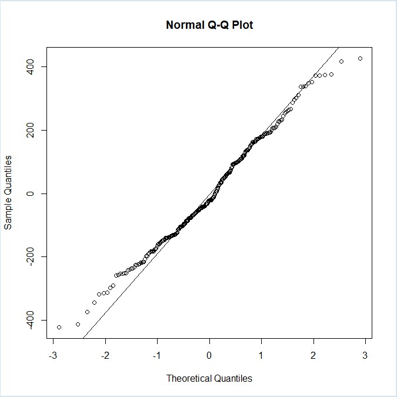
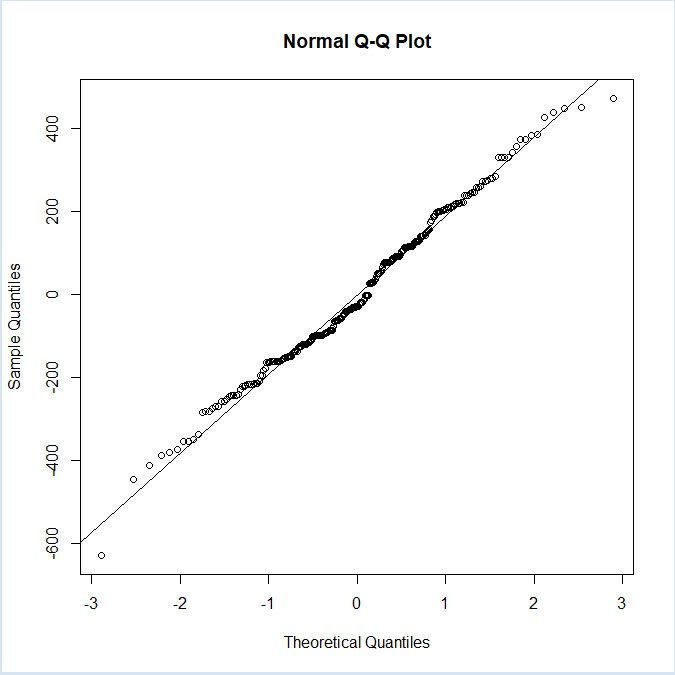
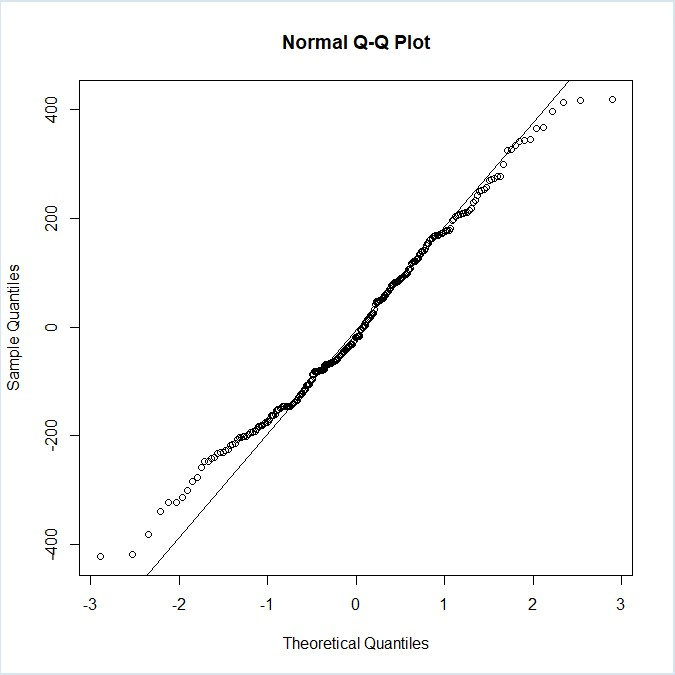

## 1. Attaching libraries and loading data

```R
library('lme4')
    
    Loading required package: Matrix

library('lmerTest')

    Attaching package: ‘lmerTest’

    The following object is masked from ‘package:lme4’:

        lmer

    The following object is masked from ‘package:stats’:

        step

library(MuMIn)

classes <- c(rep("numeric", 3), "character", rep("numeric", 2), rep("character", 2), rep("numeric", 2), "character", "numeric")

d <- read.csv('test.csv', colClasses=classes)
```

## 2. Data structure preview

```R
str(d)

    'data.frame':   264 obs. of  12 variables:
    $ ExperimentID   : num  1 1 1 1 1 1 1 1 1 1 ...
    $ UserID         : num  111 111 111 111 111 111 111 111 111 111 ...
    $ VideoID        : num  11 12 13 14 21 22 23 24 31 32 ...
    $ Activity       : chr  "Sitting" "Sitting" "Sitting" "Sitting" ...
    $ StartResolution: num  360 360 360 360 360 360 360 360 360 360 ...
    $ EndResolution  : num  720 480 720 720 720 480 480 480 360 480 ...
    $ Gender         : chr  "Male" "Male" "Male" "Male" ...
    $ Personality    : chr  "Neuroticism" "Neuroticism" "Neuroticism" "Neuroticism" ...
    $ SI             : num  8.78 38.86 138.69 136.5 14.34 ...
    $ TI             : num  3.69 36.95 8.3 28.59 3.49 ...
    $ Cluster        : chr  "00010" "00010" "00010" "00010" ...
    $ Glasses        : num  1 1 1 1 1 1 1 1 1 1 ...
```

## 3. Null model, grouping by UserID

```R
mu.null <- lmer(EndResolution ~ 1 + (1 | UserID), data=d)
summary(mu.null)

    Formula: EndResolution ~ 1 + (1 | UserID)
    Data: d

    REML criterion at convergence: 3595.5

    Scaled residuals: 
        Min      1Q  Median      3Q     Max 
    -1.9974 -0.7171 -0.2688  0.5917  2.4376 

    Random effects:
    Groups   Name        Variance Std.Dev.
    UserID   (Intercept) 15876    126.0   
    Residual             43374    208.3   
    Number of obs: 264, groups:  UserID, 22

    Fixed effects:
                Estimate Std. Error     df t value Pr(>|t|)    
    (Intercept)   670.45      29.76  21.00   22.52 3.44e-16 ***
```

## 3.1 Adding Activity, SI, TI, Glasses

### 3.1.1 Activity

```R
mu_activity <- lmer(EndResolution ~ 1 + Activity + (1 | UserID), data=d)
anova(mu.null, mu_activity)

    refitting model(s) with ML (instead of REML)
    Data: d
    Models:
    mu.null: EndResolution ~ 1 + (1 | UserID)
    mu_activity: EndResolution ~ 1 + Activity + (1 | UserID)
                npar    AIC    BIC  logLik deviance  Chisq Df Pr(>Chisq)    
    mu.null        3 3610.1 3620.9 -1802.1   3604.1                         
    mu_activity    5 3585.8 3603.7 -1787.9   3575.8 28.306  2  7.135e-07 ***

summary(mu_activity)

    Formula: EndResolution ~ 1 + Activity + (1 | UserID)
    Data: d

    REML criterion at convergence: 3550.3

    Scaled residuals: 
         Min       1Q   Median       3Q      Max 
    -2.10898 -0.72511 -0.05438  0.65369  2.36391 

    Random effects:
    Groups   Name        Variance Std.Dev.
    UserID   (Intercept) 16248    127.5   
    Residual             38907    197.2   
    Number of obs: 264, groups:  UserID, 22

    Fixed effects:
                    Estimate Std. Error     df t value Pr(>|t|)    
    (Intercept)       589.09      34.36  36.94  17.144  < 2e-16 ***
    ActivitySitting   162.27      29.74 240.00   5.457  1.2e-07 ***
    ActivityWalking    81.82      29.74 240.00   2.751  0.00639 ** 

    Correlation of Fixed Effects:
                (Intr) ActvtS
    ActvtySttng -0.433       
    ActvtyWlkng -0.433  0.500
```

### 3.1.2 SI

```R
mu_si <- lmer(EndResolution ~ 1 + SI + (1 | UserID), data=d)
anova(mu.null, mu_si)

    refitting model(s) with ML (instead of REML)
    Data: d
    Models:
    mu.null: EndResolution ~ 1 + (1 | UserID)
    mu_si: EndResolution ~ 1 + SI + (1 | UserID)
            npar    AIC    BIC  logLik deviance  Chisq Df Pr(>Chisq)    
    mu.null    3 3610.1 3620.9 -1802.1   3604.1                         
    mu_si      4 3581.5 3595.8 -1786.8   3573.5 30.607  1   3.16e-08 ***

summary(mu_si)

    Formula: EndResolution ~ 1 + SI + (1 | UserID)
    Data: d

    REML criterion at convergence: 3566

    Scaled residuals: 
        Min      1Q  Median      3Q     Max 
    -2.1069 -0.7318 -0.1108  0.6075  2.4907 

    Random effects:
    Groups   Name        Variance Std.Dev.
    UserID   (Intercept) 16292    127.6   
    Residual             38379    195.9   
    Number of obs: 264, groups:  UserID, 22

    Fixed effects:
                Estimate Std. Error       df t value Pr(>|t|)    
    (Intercept) 778.9796    35.3327  41.1007   22.05  < 2e-16 ***
    SI           -1.3606     0.2387 241.0000   -5.70 3.48e-08 ***

    Correlation of Fixed Effects:
    (Intr)
    SI -0.539
```

### 3.1.3 TI

```R
mu_ti <- lmer(EndResolution ~ 1 + TI + (1 | UserID), data=d)
anova(mu.null, mu_ti)

    refitting model(s) with ML (instead of REML)
    Data: d
    Models:
    mu.null: EndResolution ~ 1 + (1 | UserID)
    mu_ti: EndResolution ~ 1 + TI + (1 | UserID)
            npar    AIC    BIC  logLik deviance  Chisq Df Pr(>Chisq)
    mu.null    3 3610.1 3620.9 -1802.1   3604.1                     
    mu_ti      4 3610.0 3624.3 -1801.0   3602.0 2.1472  1     0.1428
```

### 3.1.4 Glasses

```R
mu_glasses <- lmer(EndResolution ~ 1 + Glasses + (1 | UserID), data=d)
anova(mu.null, mu_glasses)

    refitting model(s) with ML (instead of REML)
    Data: d
    Models:
    mu.null: EndResolution ~ 1 + (1 | UserID)
    mu_glasses: EndResolution ~ 1 + Glasses + (1 | UserID)
               npar    AIC    BIC  logLik deviance  Chisq Df Pr(>Chisq)
    mu.null       3 3610.1 3620.9 -1802.1   3604.1                     
    mu_glasses    4 3610.7 3625.0 -1801.3   3602.7 1.4278  1     0.2321
```

* Models with SI, and Activity have better AIC and BIC.

## 3.2 Adding Activity, TI, Glasses, Gender to SI model(mu_si)

### 3.2.1 Activity

```R
mu_si_activity <- lmer(EndResolution ~ 1 + SI + Activity + (1 | UserID), data=d)
mu_si_activity_i <- lmer(EndResolution ~ 1 + SI * Activity + (1 | UserID), data=d)

anova(mu_si_activity, mu_si_activity_i)
    
    refitting model(s) with ML (instead of REML)
    Data: d
    Models:
    mu_si_activity: EndResolution ~ 1 + SI + Activity + (1 | UserID)
    mu_si_activity_i: EndResolution ~ 1 + SI * Activity + (1 | UserID)
                     npar    AIC    BIC  logLik deviance Chisq Df Pr(>Chisq)   
    mu_si_activity      6 3555.7 3577.2 -1771.9   3543.7                       
    mu_si_activity_i    8 3548.6 3577.2 -1766.3   3532.6 11.07  2   0.003947 **

summary(mu_si_activity_i)

    Formula: EndResolution ~ 1 + SI * Activity + (1 | UserID)
    Data: d

    REML criterion at convergence: 3507.6

    Scaled residuals: 
        Min      1Q  Median      3Q     Max 
    -2.4720 -0.6172 -0.1986  0.7534  2.4524 

    Random effects:
    Groups   Name        Variance Std.Dev.
    UserID   (Intercept) 16744    129.4   
    Residual             32960    181.5   
    Number of obs: 264, groups:  UserID, 22

    Fixed effects:
                       Estimate Std. Error       df t value Pr(>|t|)    
    (Intercept)        706.6150    49.7107 127.2808  14.215  < 2e-16 ***
    SI                  -1.3682     0.4255 237.0000  -3.216 0.001482 ** 
    ActivitySitting    205.9716    53.0368 237.0000   3.884 0.000134 ***
    ActivityWalking    -19.9229    54.8294 237.0000  -0.363 0.716658    
    SI:ActivitySitting  -0.6294     0.5411 237.0000  -1.163 0.245927    
    SI:ActivityWalking   1.1511     0.5962 237.0000   1.931 0.054712 .  

    Correlation of Fixed Effects:
                (Intr) SI     ActvtS ActvtW SI:AcS
    SI          -0.735                            
    ActvtySttng -0.649  0.689                     
    ActvtyWlkng -0.627  0.667  0.588              
    SI:ActvtySt  0.578 -0.786 -0.856 -0.524       
    SI:ActvtyWl  0.525 -0.714 -0.492 -0.864  0.561
```

### 3.2.2 TI

```R
mu_si_ti <- lmer(EndResolution ~ 1 + SI + TI + (1 | UserID), data=d)

# model with interaction not included because of warning:
# Some predictor variables are on very different scales: consider rescaling

anova(mu_si, mu_si_ti)

    refitting model(s) with ML (instead of REML)
    Data: d
    Models:
    mu_si: EndResolution ~ 1 + SI + (1 | UserID)
    mu_si_ti: EndResolution ~ 1 + SI + TI + (1 | UserID)
             npar    AIC    BIC  logLik deviance  Chisq Df Pr(>Chisq)
    mu_si       4 3581.5 3595.8 -1786.8   3573.5                     
    mu_si_ti    5 3582.8 3600.7 -1786.4   3572.8 0.7154  1     0.3977
```

### 3.2.3 Glasses

```R
mu_si_glasses <- lmer(EndResolution ~ 1 + SI + Glasses + (1 | UserID), data=d)
mu_si_glasses_i <- lmer(EndResolution ~ 1 + SI * Glasses + (1 | UserID), data=d)

anova(mu_si, mu_si_glasses, mu_si_glasses_i)

    refitting model(s) with ML (instead of REML)
    Data: d
    Models:
    mu_si: EndResolution ~ 1 + SI + (1 | UserID)
    mu_si_glasses: EndResolution ~ 1 + SI + Glasses + (1 | UserID)
    mu_si_glasses_i: EndResolution ~ 1 + SI * Glasses + (1 | UserID)
                    npar    AIC    BIC  logLik deviance  Chisq Df Pr(>Chisq)
    mu_si              4 3581.5 3595.8 -1786.8   3573.5                     
    mu_si_glasses      5 3582.1 3600.0 -1786.0   3572.1 1.4278  1     0.2321
    mu_si_glasses_i    6 3581.7 3603.2 -1784.8   3569.7 2.4021  1     0.1212
```

### 3.2.4 Gender 

```R
mu_si_gender <- lmer(EndResolution ~ 1 + SI + Gender + (1 | UserID), data=d)
mu_si_gender_i <- lmer(EndResolution ~ 1 + SI * Gender + (1 | UserID), data=d)

anova(mu_si, mu_si_gender, mu_si_gender_i)

    refitting model(s) with ML (instead of REML)
    Data: d
    Models:
    mu_si: EndResolution ~ 1 + SI + (1 | UserID)
    mu_si_gender: EndResolution ~ 1 + SI + Gender + (1 | UserID)
    mu_si_gender_i: EndResolution ~ 1 + SI * Gender + (1 | UserID)
                   npar    AIC    BIC  logLik deviance  Chisq Df Pr(>Chisq)   
    mu_si             4 3581.5 3595.8 -1786.8   3573.5                        
    mu_si_gender      5 3583.3 3601.2 -1786.6   3573.3 0.2366  1   0.626649   
    mu_si_gender_i    6 3575.4 3596.9 -1781.7   3563.4 9.8796  1   0.001671 **

summary(mu_si_gender_i)

    Formula: EndResolution ~ 1 + SI * Gender + (1 | UserID)
    Data: d

    REML criterion at convergence: 3545.5

    Scaled residuals: 
        Min      1Q  Median      3Q     Max 
    -2.1791 -0.6599 -0.1294  0.6398  2.4506 

    Random effects:
    Groups   Name        Variance Std.Dev.
    UserID   (Intercept) 17163    131.0   
    Residual             36997    192.3   
    Number of obs: 264, groups:  UserID, 22

    Fixed effects:
                  Estimate Std. Error       df t value Pr(>|t|)    
    (Intercept)   828.2821    52.8520  37.6198  15.672  < 2e-16 ***
    SI             -2.1724     0.3476 240.0000  -6.250 1.86e-09 ***
    GenderMale    -90.3879    71.5619  37.6198  -1.263  0.21434    
    SI:GenderMale   1.4884     0.4707 240.0000   3.162  0.00177 ** 

    Correlation of Fixed Effects:
                (Intr) SI     GndrMl
    SI          -0.525              
    GenderMale  -0.739  0.387       
    SI:GenderMl  0.387 -0.739 -0.525

```

## 3.3 Adding TI, Glasses, Gender to model with SI and Activity(mu_si_activity_i)

### 3.3.1 TI

```R
mu_si_activity_i_ti <- lmer(EndResolution ~ 1 + SI * Activity + TI + (1 | UserID), data=d)
mu_si_activity_i_ti_i <- lmer(EndResolution ~ 1 + SI * Activity + TI * Activity + (1 | UserID), data=d)

anova(mu_si_activity_i, mu_si_activity_i_ti, mu_si_activity_i_ti_i)

    refitting model(s) with ML (instead of REML)
    Data: d
    Models:
    mu_si_activity_i: EndResolution ~ 1 + SI * Activity + (1 | UserID)
    mu_si_activity_i_ti: EndResolution ~ 1 + SI * Activity + TI + (1 | UserID)
    mu_si_activity_i_ti_i: EndResolution ~ 1 + SI * Activity + TI * Activity + (1 | UserID)
                          npar    AIC    BIC  logLik deviance  Chisq Df Pr(>Chisq)  
    mu_si_activity_i         8 3548.6 3577.2 -1766.3   3532.6                       
    mu_si_activity_i_ti      9 3549.9 3582.1 -1766.0   3531.9 0.7230  1    0.39516  
    mu_si_activity_i_ti_i   11 3549.3 3588.6 -1763.7   3527.3 4.6249  2    0.09902 .
```

### 3.3.2 Glasses

```R
mu_si_activity_i_glasses <- lmer(EndResolution ~ 1 + SI * Activity + Glasses + (1 | UserID), data=d)
mu_si_activity_i_glasses_i <- lmer(EndResolution ~ 1 + SI * Activity + Glasses * Activity + (1 | UserID), data=d)

anova(mu_si_activity_i, mu_si_activity_i_glasses, mu_si_activity_i_glasses_i)

    refitting model(s) with ML (instead of REML)
    Data: d
    Models:
    mu_si_activity_i: EndResolution ~ 1 + SI * Activity + (1 | UserID)
    mu_si_activity_i_glasses: EndResolution ~ 1 + SI * Activity + Glasses + (1 | UserID)
    mu_si_activity_i_glasses_i: EndResolution ~ 1 + SI * Activity + Glasses * Activity + (1 | UserID)
                               npar    AIC    BIC  logLik deviance  Chisq Df Pr(>Chisq)
    mu_si_activity_i              8 3548.6 3577.2 -1766.3   3532.6                     
    mu_si_activity_i_glasses      9 3549.2 3581.4 -1765.6   3531.2 1.4278  1     0.2321
    mu_si_activity_i_glasses_i   11 3552.8 3592.2 -1765.4   3530.8 0.3914  2     0.8222
```

### 3.3.3 Gender

```R
mu_si_activity_i_gender <- lmer(EndResolution ~ 1 + SI*Activity + Gender + (1 | UserID), data=d)
mu_si_activity_i_gender_i <- lmer(EndResolution ~ 1 + SI*Activity + SI*Gender + (1 | UserID), data=d)

anova(mu_si_activity_i, mu_si_activity_i_gender, mu_si_activity_i_gender_i)

    refitting model(s) with ML (instead of REML)
    Data: d
    Models:
    mu_si_activity_i: EndResolution ~ 1 + SI * Activity + (1 | UserID)
    mu_si_activity_i_gender: EndResolution ~ 1 + SI * Activity + Gender + (1 | UserID)
    mu_si_activity_i_gender_i: EndResolution ~ 1 + SI * Activity + SI * Gender + (1 | UserID)
                              npar    AIC    BIC  logLik deviance   Chisq Df Pr(>Chisq)    
    mu_si_activity_i             8 3548.6 3577.2 -1766.3   3532.6                          
    mu_si_activity_i_gender      9 3550.4 3582.6 -1766.2   3532.4  0.2366  1  0.6266494    
    mu_si_activity_i_gender_i   10 3540.7 3576.4 -1760.3   3520.7 11.7428  1  0.0006108 ***

summary(mu_si_activity_i_gender_i)

    Formula: EndResolution ~ 1 + SI * Activity + SI * Gender + (1 | UserID)
    Data: d

    REML criterion at convergence: 3485.7

    Scaled residuals: 
        Min      1Q  Median      3Q     Max 
    -2.3790 -0.7305 -0.1233  0.6862  2.4044 

    Random effects:
    Groups   Name        Variance Std.Dev.
    UserID   (Intercept) 17618    132.7   
    Residual             31532    177.6   
    Number of obs: 264, groups:  UserID, 22

    Fixed effects:
                       Estimate Std. Error       df t value Pr(>|t|)    
    (Intercept)        755.9174    62.4380  69.1378  12.107  < 2e-16 ***
    SI                  -2.1801     0.4789 236.0000  -4.552 8.50e-06 ***
    ActivitySitting    205.9716    51.8751 236.0000   3.971 9.52e-05 ***
    ActivityWalking    -19.9229    53.6284 236.0000  -0.371 0.710599    
    GenderMale         -90.3879    70.0922  34.7310  -1.290 0.205726    
    SI:ActivitySitting  -0.6294     0.5293 236.0000  -1.189 0.235546    
    SI:ActivityWalking   1.1511     0.5831 236.0000   1.974 0.049554 *  
    SI:GenderMale        1.4884     0.4345 236.0000   3.426 0.000724 ***

    Correlation of Fixed Effects:
                (Intr) SI     ActvtS ActvtW GndrMl SI:AcS SI:AcW
    SI          -0.647                                          
    ActvtySttng -0.505  0.599                                   
    ActvtyWlkng -0.489  0.579  0.588                            
    GenderMale  -0.612  0.245  0.000  0.000                     
    SI:ActvtySt  0.450 -0.683 -0.856 -0.524  0.000              
    SI:ActvtyWl  0.409 -0.620 -0.492 -0.864  0.000  0.561       
    SI:GenderMl  0.303 -0.495  0.000  0.000 -0.494  0.000  0.000
```

## 3.4 Final Model

```R
mu_si_activity_i_gender_i: EndResolution ~ 1 + SI * Activity + SI * Gender + (1 | UserID)

r.squaredGLMM(mu_si_activity_i_gender_i)
    
               R2m       R2c
    [1,] 0.1937995 0.4827858
```


## 4. Null model, grouping by Personality

```R
mp.null <- lmer(EndResolution ~ 1 + (1 | Personality), data=d)
summary(mp.null)

    Formula: EndResolution ~ 1 + (1 | Personality)
    Data: d

    REML criterion at convergence: 3628.7

    Scaled residuals: 
        Min      1Q  Median      3Q     Max 
    -1.6735 -0.7588 -0.1396  0.5122  2.0461 

    Random effects:
    Groups      Name        Variance Std.Dev.
    Personality (Intercept)  4931     70.22  
    Residual                55087    234.71  
    Number of obs: 264, groups:  Personality, 4

    Fixed effects:
                Estimate Std. Error      df t value Pr(>|t|)    
    (Intercept)  663.253     38.174   2.984   17.37 0.000428 ***
```

## 4.1 Adding Activity, SI, TI, Glasses

### 4.1.1 Activity

```R
mp_activity <- lmer(EndResolution ~ 1 + Activity + (1 | Personality), data=d)
anova(mp.null, mp_activity)

    refitting model(s) with ML (instead of REML)
    Data: d
    Models:
    mp.null: EndResolution ~ 1 + (1 | Personality)
    mp_activity: EndResolution ~ 1 + Activity + (1 | Personality)
                npar    AIC    BIC  logLik deviance  Chisq Df Pr(>Chisq)    
    mp.null        3 3643.7 3654.4 -1818.8   3637.7                         
    mp_activity    5 3625.7 3643.6 -1807.9   3615.7 21.932  2  1.728e-05 ***

summary(mp_activity)

    Formula: EndResolution ~ 1 + Activity + (1 | Personality)
    Data: d

    REML criterion at convergence: 3589.3

    Scaled residuals: 
        Min      1Q  Median      3Q     Max 
    -2.1016 -0.7902 -0.1517  0.6345  2.4909 

    Random effects:
    Groups      Name        Variance Std.Dev.
    Personality (Intercept)  4997     70.69  
    Residual                51023    225.88  
    Number of obs: 264, groups:  Personality, 4

    Fixed effects:
                    Estimate Std. Error      df t value Pr(>|t|)    
    (Intercept)      581.775     42.942   4.778  13.548 5.39e-05 ***
    ActivitySitting  162.273     34.053 257.999   4.765 3.15e-06 ***
    ActivityWalking   81.818     34.053 257.999   2.403    0.017 *  

    Correlation of Fixed Effects:
                (Intr) ActvtS
    ActvtySttng -0.397       
    ActvtyWlkng -0.397  0.500
```
### 4.1.2 SI

```R
mp_si <- lmer(EndResolution ~ 1 + SI + (1 | Personality), data=d)
anova(mp.null, mp_si)

    refitting model(s) with ML (instead of REML)
    Data: d
    Models:
    mp.null: EndResolution ~ 1 + (1 | Personality)
    mp_si: EndResolution ~ 1 + SI + (1 | Personality)
            npar    AIC    BIC  logLik deviance  Chisq Df Pr(>Chisq)    
    mp.null    3 3643.7 3654.4 -1818.8   3637.7                         
    mp_si      4 3622.0 3636.3 -1807.0   3614.0 23.683  1  1.136e-06 ***

summary(mp_si)

    Formula: EndResolution ~ 1 + SI + (1 | Personality)
    Data: d

    REML criterion at convergence: 3605.8

    Scaled residuals: 
        Min      1Q  Median      3Q     Max 
    -2.0010 -0.7810 -0.1623  0.6326  2.3783 

    Random effects:
    Groups      Name        Variance Std.Dev.
    Personality (Intercept)  5007     70.76  
    Residual                50485    224.69  
    Number of obs: 264, groups:  Personality, 4

    Fixed effects:
                Estimate Std. Error       df t value Pr(>|t|)    
    (Intercept) 771.6481    43.9819   5.2546   17.55 7.25e-06 ***
    SI           -1.3606     0.2738 258.9994   -4.97 1.22e-06 ***

    Correlation of Fixed Effects:
    (Intr)
    SI -0.496
```

### 4.1.3 TI

```R
mp_ti <- lmer(EndResolution ~ 1 + TI + (1 | Personality), data=d)
anova(mp.null, mp_ti)

    refitting model(s) with ML (instead of REML)
    Data: d
    Models:
    mp.null: EndResolution ~ 1 + (1 | Personality)
    mp_ti: EndResolution ~ 1 + TI + (1 | Personality)
            npar    AIC    BIC  logLik deviance  Chisq Df Pr(>Chisq)
    mp.null    3 3643.7 3654.4 -1818.8   3637.7                     
    mp_ti      4 3644.0 3658.3 -1818.0   3636.0 1.6886  1     0.1938
```

### 4.1.4 Glasses

```R
mp_glasses <- lmer(EndResolution ~ 1 + Glasses + (1 | Personality), data=d)
anova(mp.null, mp_glasses)

    refitting model(s) with ML (instead of REML)
    Data: d
    Models:
    mp.null: EndResolution ~ 1 + (1 | Personality)
    mp_glasses: EndResolution ~ 1 + Glasses + (1 | Personality)
               npar    AIC    BIC  logLik deviance  Chisq Df Pr(>Chisq)
    mp.null       3 3643.7 3654.4 -1818.8   3637.7                     
    mp_glasses    4 3643.5 3657.8 -1817.8   3635.5 2.1165  1     0.1457
```

## 4.2 Adding Activity, TI, Glasses to SI model(mp_si)

### 4.2.1 Activity

```R
mp_si_activity <- lmer(EndResolution ~ 1 + SI + Activity + (1 | Personality), data=d)
mp_si_activity_i <- lmer(EndResolution ~ 1 + SI * Activity + (1 | Personality), data=d)

anova(mp_si_activity, mp_si_activity_i)

    refitting model(s) with ML (instead of REML)
    Data: d
    Models:
    mp_si_activity: EndResolution ~ 1 + SI + Activity + (1 | Personality)
    mp_si_activity_i: EndResolution ~ 1 + SI * Activity + (1 | Personality)
                     npar    AIC    BIC  logLik deviance  Chisq Df Pr(>Chisq)  
    mp_si_activity      6 3603.7 3625.2 -1795.9   3591.7                       
    mp_si_activity_i    8 3599.7 3628.3 -1791.8   3583.7 8.0424  2    0.01793 *

summary(mp_si_activity_i)

    Formula: EndResolution ~ 1 + SI * Activity + (1 | Personality)
    Data: d

    REML criterion at convergence: 3556.6

    Scaled residuals: 
         Min       1Q   Median       3Q      Max 
    -2.61982 -0.74417 -0.09471  0.51300  2.35394 

    Random effects:
    Groups      Name        Variance Std.Dev.
    Personality (Intercept)  5086     71.32  
    Residual                45639    213.63  
    Number of obs: 264, groups:  Personality, 4

    Fixed effects:
                       Estimate Std. Error       df t value Pr(>|t|)    
    (Intercept)        699.1460    60.4390  18.2843  11.568 7.56e-10 ***
    SI                  -1.3682     0.5006 254.9997  -2.733  0.00672 ** 
    ActivitySitting    205.9716    62.4092 254.9997   3.300  0.00110 ** 
    ActivityWalking    -19.9229    64.5186 254.9997  -0.309  0.75773    
    SI:ActivitySitting  -0.6294     0.6368 254.9997  -0.988  0.32385    
    SI:ActivityWalking   1.1511     0.7015 254.9997   1.641  0.10208    

    Correlation of Fixed Effects:
                (Intr) SI     ActvtS ActvtW SI:AcS
    SI          -0.712                            
    ActvtySttng -0.628  0.689                     
    ActvtyWlkng -0.607  0.667  0.588              
    SI:ActvtySt  0.559 -0.786 -0.856 -0.524       
    SI:ActvtyWl  0.508 -0.714 -0.492 -0.864  0.561
```

### 4.2.2 TI

```R
mp_si_ti <- lmer(EndResolution ~ 1 + SI + TI + (1 | Personality), data=d)

# model with interaction not included because of warning:
# Some predictor variables are on very different scales: consider rescaling

anova(mp_si, mp_si_ti)

    refitting model(s) with ML (instead of REML)
    Data: d
    Models:
    mp_si: EndResolution ~ 1 + SI + (1 | Personality)
    mp_si_ti: EndResolution ~ 1 + SI + TI + (1 | Personality)
             npar    AIC    BIC  logLik deviance  Chisq Df Pr(>Chisq)
    mp_si       4 3622.0 3636.3 -1807.0   3614.0                     
    mp_si_ti    5 3623.4 3641.3 -1806.7   3613.4 0.5435  1      0.461
```

### 4.2.3 Glasses

```R
mp_si_glasses <- lmer(EndResolution ~ 1 + SI + Glasses + (1 | Personality), data=d)
mp_si_glasses_i <- lmer(EndResolution ~ 1 + SI * Glasses + (1 | Personality), data=d)

anova(mp_si, mp_si_glasses, mp_si_glasses_i)

    refitting model(s) with ML (instead of REML)
    Data: d
    Models:
    mp_si: EndResolution ~ 1 + SI + (1 | Personality)
    mp_si_glasses: EndResolution ~ 1 + SI + Glasses + (1 | Personality)
    mp_si_glasses_i: EndResolution ~ 1 + SI * Glasses + (1 | Personality)
                    npar    AIC    BIC  logLik deviance  Chisq Df Pr(>Chisq)
    mp_si              4 3622.0 3636.3 -1807.0   3614.0                     
    mp_si_glasses      5 3621.7 3639.6 -1805.9   3611.7 2.2375  1     0.1347
    mp_si_glasses_i    6 3621.9 3643.4 -1805.0   3609.9 1.8327  1     0.1758
```

## 4.3 Adding TI, Glasses, Gender to model with SI and Activity(mp_si_activity_i)

### 4.3.1 TI

```R
mp_si_activity_i_ti <- lmer(EndResolution ~ 1 + SI*Activity + TI + (1 | Personality), data=d)
mp_si_activity_i_ti_i <- lmer(EndResolution ~ 1 + SI*Activity + TI*Activity + (1 | Personality), data=d)

anova(mp_si_activity_i, mp_si_activity_i_ti, mp_si_activity_i_ti_i)

    refitting model(s) with ML (instead of REML)
    Data: d
    Models:
    mp_si_activity_i: EndResolution ~ 1 + SI * Activity + (1 | Personality)
    mp_si_activity_i_ti: EndResolution ~ 1 + SI * Activity + TI + (1 | Personality)
    mp_si_activity_i_ti_i: EndResolution ~ 1 + SI * Activity + TI * Activity + (1 | Personality)
                          npar    AIC    BIC  logLik deviance  Chisq Df Pr(>Chisq)
    mp_si_activity_i         8 3599.7 3628.3 -1791.8   3583.7                     
    mp_si_activity_i_ti      9 3601.2 3633.3 -1791.6   3583.2 0.5211  1     0.4704
    mp_si_activity_i_ti_i   11 3601.8 3641.2 -1789.9   3579.8 3.3214  2     0.1900
```

### 4.3.2 Glasses

```R
mp_si_activity_i_glasses <- lmer(EndResolution ~ 1 + SI*Activity + Glasses + (1 | Personality), data=d)
mp_si_activity_i_glasses_i <- lmer(EndResolution ~ 1 + SI*Activity + SI*Glasses + (1 | Personality), data=d)

anova(mp_si_activity_i, mp_si_activity_i_glasses, mp_si_activity_i_glasses_i)

    refitting model(s) with ML (instead of REML)
    Data: d
    Models:
    mp_si_activity_i: EndResolution ~ 1 + SI * Activity + (1 | Personality)
    mp_si_activity_i_glasses: EndResolution ~ 1 + SI * Activity + Glasses + (1 | Personality)
    mp_si_activity_i_glasses_i: EndResolution ~ 1 + SI * Activity + SI * Glasses + (1 | Personality)
                               npar    AIC    BIC  logLik deviance  Chisq Df Pr(>Chisq)
    mp_si_activity_i              8 3599.7 3628.3 -1791.8   3583.7                     
    mp_si_activity_i_glasses      9 3599.3 3631.5 -1790.6   3581.3 2.4107  1     0.1205
    mp_si_activity_i_glasses_i   10 3599.2 3635.0 -1789.6   3579.2 2.0615  1     0.1511
```

### 4.3.3 Gender

```R
mp_si_activity_i_gender <- lmer(EndResolution ~ 1 + SI*Activity + Gender + (1 | Personality), data=d)
mp_si_activity_i_gender_i <- lmer(EndResolution ~ 1 + SI*Activity + SI*Gender + (1 | Personality), data=d)

anova(mp_si_activity_i, mp_si_activity_i_gender, mp_si_activity_i_gender_i)

    refitting model(s) with ML (instead of REML)
    Data: d
    Models:
    mp_si_activity_i: EndResolution ~ 1 + SI * Activity + (1 | Personality)
    mp_si_activity_i_gender: EndResolution ~ 1 + SI * Activity + Gender + (1 | Personality)
    mp_si_activity_i_gender_i: EndResolution ~ 1 + SI * Activity + SI * Gender + (1 | Personality)
                              npar    AIC    BIC  logLik deviance  Chisq Df Pr(>Chisq)   
    mp_si_activity_i             8 3599.7 3628.3 -1791.8   3583.7                        
    mp_si_activity_i_gender      9 3601.7 3633.9 -1791.8   3583.7 0.0014  1    0.97035   
    mp_si_activity_i_gender_i   10 3595.3 3631.0 -1787.6   3575.3 8.4009  1    0.00375 **

summary(mp_si_activity_i_gender_i)

    Formula: EndResolution ~ 1 + SI * Activity + SI * Gender + (1 | Personality)
    Data: d

    REML criterion at convergence: 3539.3

    Scaled residuals: 
         Min       1Q   Median       3Q      Max 
    -2.52112 -0.76134 -0.05077  0.65483  2.47826 

    Random effects:
    Groups      Name        Variance Std.Dev.
    Personality (Intercept)  5227     72.3   
    Residual                44525    211.0   
    Number of obs: 264, groups:  Personality, 4

    Fixed effects:
                        Estimate Std. Error        df t value Pr(>|t|)    
    (Intercept)         765.4728    66.5638   24.5351  11.500 2.26e-11 ***
    SI                   -2.1801     0.5691  253.0164  -3.831 0.000161 ***
    ActivitySitting     205.9716    61.6428  253.0164   3.341 0.000960 ***
    ActivityWalking     -19.9229    63.7262  253.0164  -0.313 0.754817    
    GenderMale         -121.5275    50.7554  255.9935  -2.394 0.017369 *  
    SI:ActivitySitting   -0.6294     0.6289  253.0164  -1.001 0.317886    
    SI:ActivityWalking    1.1511     0.6929  253.0164   1.661 0.097919 .  
    SI:GenderMale         1.4884     0.5163  253.0164   2.883 0.004282 ** 

    Correlation of Fixed Effects:
                (Intr) SI     ActvtS ActvtW GndrMl SI:AcS SI:AcW
    SI          -0.722                                          
    ActvtySttng -0.563  0.599                                   
    ActvtyWlkng -0.545  0.579  0.588                            
    GenderMale  -0.425  0.402  0.000  0.000                     
    SI:ActvtySt  0.502 -0.683 -0.856 -0.524  0.000              
    SI:ActvtyWl  0.455 -0.620 -0.492 -0.864  0.000  0.561       
    SI:GenderMl  0.337 -0.495  0.000  0.000 -0.811  0.000  0.000
```

## 4.4 Adding TI, Glasses to model with SI, Activity, Gender(mp_si_activity_i_gender_i)

### 4.4.1 TI

```R
mp_si_ai_gi_ti <- lmer(EndResolution ~ 1 + SI*Activity + SI*Gender + TI + (1 | Personality), data=d)
mp_si_ai_gi_ti_i <- lmer(EndResolution ~ 1 + SI*Activity + SI*Gender + TI*Activity + (1 | Personality), data=d)

anova(mp_si_activity_i_gender_i, mp_si_ai_gi_ti, mp_si_ai_gi_ti_i)

    refitting model(s) with ML (instead of REML)
    Data: d
    Models:
    mp_si_activity_i_gender_i: EndResolution ~ 1 + SI * Activity + SI * Gender + (1 | Personality)
    mp_si_ai_gi_ti: EndResolution ~ 1 + SI * Activity + SI * Gender + TI + (1 | Personality)
    mp_si_ai_gi_ti_i: EndResolution ~ 1 + SI * Activity + SI * Gender + TI * Activity + 
    mp_si_ai_gi_ti_i:     (1 | Personality)
                              npar    AIC    BIC  logLik deviance  Chisq Df Pr(>Chisq)
    mp_si_activity_i_gender_i   10 3595.3 3631.0 -1787.6   3575.3                     
    mp_si_ai_gi_ti              11 3596.7 3636.1 -1787.4   3574.7 0.5383  1     0.4631
    mp_si_ai_gi_ti_i            13 3597.3 3643.8 -1785.7   3571.3 3.4317  2     0.1798
```

### 4.4.2 Glasses (Fixed + Random effect)

```R
mp_si_ai_gi_glasses <- lmer(EndResolution ~ 1 + SI*Activity + SI*Gender + Glasses + (Glasses || Personality), data=d)
mp_si_ai_gi_glasses_i <- lmer(EndResolution ~ 1 + SI*Activity + SI*Gender + SI*Glasses + (Glasses || Personality), data=d)

anova(mp_si_activity_i_gender_i, mp_si_ai_gi_glasses, mp_si_ai_gi_glasses_i)

    refitting model(s) with ML (instead of REML)
    Data: d
    Models:
    mp_si_activity_i_gender_i: EndResolution ~ 1 + SI * Activity + SI * Gender + (1 | Personality)
    mp_si_ai_gi_glasses: EndResolution ~ 1 + SI * Activity + SI * Gender + Glasses + (Glasses || Personality)
    mp_si_ai_gi_glasses_i: EndResolution ~ 1 + SI * Activity + SI * Gender + SI * Glasses + (Glasses || Personality)
                              npar    AIC    BIC  logLik deviance   Chisq Df Pr(>Chisq)    
    mp_si_activity_i_gender_i   10 3595.3 3631.0 -1787.6   3575.3                          
    mp_si_ai_gi_glasses         12 3579.4 3622.3 -1777.7   3555.4 19.9169  2  4.733e-05 ***
    mp_si_ai_gi_glasses_i       13 3580.8 3627.3 -1777.4   3554.8  0.5413  1     0.4619 

summary(mp_si_ai_gi_glasses)

    Formula: EndResolution ~ 1 + SI * Activity + SI * Gender + Glasses + (Glasses ||      Personality)
    Data: d

    REML criterion at convergence: 3509

    Scaled residuals: 
        Min      1Q  Median      3Q     Max 
    -2.9427 -0.7248 -0.1254  0.6412  2.4162 

    Random effects:
    Groups        Name        Variance Std.Dev.
    Personality   (Intercept)  6111     78.17  
    Personality.1 Glasses     25995    161.23  
    Residual                  40052    200.13  
    Number of obs: 264, groups:  Personality, 4

    Fixed effects:
                       Estimate Std. Error       df t value Pr(>|t|)    
    (Intercept)        687.3354    71.4963  10.4970   9.614 1.57e-06 ***
    SI                  -2.1801     0.5397 249.1130  -4.039 7.15e-05 ***
    ActivitySitting    205.9716    58.4647 249.1130   3.523 0.000507 ***
    ActivityWalking    -19.9229    60.4407 249.1130  -0.330 0.741958    
    GenderMale         -88.8596    49.1246 253.7627  -1.809 0.071656 .  
    Glasses             75.0876    88.5382   3.1516   0.848 0.455955    
    SI:ActivitySitting  -0.6294     0.5965 249.1130  -1.055 0.292362    
    SI:ActivityWalking   1.1511     0.6572 249.1130   1.751 0.081096 .  
    SI:GenderMale        1.4884     0.4897 249.1130   3.039 0.002623 ** 

    Correlation of Fixed Effects:
                (Intr) SI     ActvtS ActvtW GndrMl Glasss SI:AcS SI:AcW
    SI          -0.637                                                 
    ActvtySttng -0.497  0.599                                          
    ActvtyWlkng -0.481  0.579  0.588                                   
    GenderMale  -0.383  0.394  0.000  0.000                            
    Glasses     -0.150  0.000  0.000  0.000  0.012                     
    SI:ActvtySt  0.443 -0.683 -0.856 -0.524  0.000  0.000              
    SI:ActvtyWl  0.402 -0.620 -0.492 -0.864  0.000  0.000  0.561       
    SI:GenderMl  0.298 -0.495  0.000  0.000 -0.795  0.000  0.000  0.000
```

## 4.5 Adding gender as random effect

```R
mp_si_ai_gir_glasses <- lmer(EndResolution ~ 1 + SI*Activity + SI*Gender + Glasses + (Glasses + Gender || Personality), data=d)

anova(mp_si_ai_gir_glasses, mp_si_ai_gi_glasses)
    
    refitting model(s) with ML (instead of REML)
    Data: d
    Models:
    mp_si_ai_gi_glasses: EndResolution ~ 1 + SI * Activity + SI * Gender + Glasses + (Glasses || Personality)
    mp_si_ai_gir_glasses: EndResolution ~ 1 + SI * Activity + SI * Gender + Glasses + (Glasses + Gender || Personality)
                         npar    AIC    BIC  logLik deviance  Chisq Df Pr(>Chisq)  
    mp_si_ai_gi_glasses    12 3579.4 3622.3 -1777.7   3555.4                       
    mp_si_ai_gir_glasses   15 3576.5 3630.2 -1773.3   3546.5 8.8468  3     0.0314 *

summary(mp_si_ai_gir_glasses)

    Formula: EndResolution ~ 1 + SI * Activity + SI * Gender + Glasses + (Glasses + Gender || Personality)
    Data: d

    REML criterion at convergence: 3498.9

    Scaled residuals: 
        Min      1Q  Median      3Q     Max 
    -3.2440 -0.6692 -0.1509  0.6539  2.4416 

    Random effects:
    Groups        Name         Variance Std.Dev. Corr
    Personality   (Intercept)   2401     49.00       
    Personality.1 Glasses      30167    173.69       
    Personality.2 GenderFemale 26588    163.06       
                  GenderMale    1323     36.37   0.64
    Residual                   37638    194.01       
    Number of obs: 264, groups:  Personality, 4

    Fixed effects:
                       Estimate Std. Error       df t value Pr(>|t|)    
    (Intercept)        661.9274   103.8000   4.2745   6.377 0.002467 ** 
    SI                  -2.1801     0.5232 246.3042  -4.167 4.28e-05 ***
    ActivitySitting    205.9716    56.6758 246.3042   3.634 0.000339 ***
    ActivityWalking    -19.9229    58.5913 246.3042  -0.340 0.734122    
    GenderMale         -79.4923    86.0606   4.4882  -0.924 0.402586    
    Glasses             83.8212    93.7674   3.0925   0.894 0.435432    
    SI:ActivitySitting  -0.6294     0.5783 246.3042  -1.088 0.277441    
    SI:ActivityWalking   1.1511     0.6371 246.3042   1.807 0.072022 .  
    SI:GenderMale        1.4884     0.4747 246.3042   3.135 0.001925 ** 

    Correlation of Fixed Effects:
                (Intr) SI     ActvtS ActvtW GndrMl Glasss SI:AcS SI:AcW
    SI          -0.425                                                 
    ActvtySttng -0.332  0.599                                          
    ActvtyWlkng -0.321  0.579  0.588                                   
    GenderMale  -0.793  0.218  0.000  0.000                            
    Glasses     -0.095  0.000  0.000  0.000  0.017                     
    SI:ActvtySt  0.296 -0.683 -0.856 -0.524  0.000  0.000              
    SI:ActvtyWl  0.268 -0.620 -0.492 -0.864  0.000  0.000  0.561       
    SI:GenderMl  0.199 -0.495  0.000  0.000 -0.440  0.000  0.000  0.000
```

## 4.6 Final model

```R
mp_si_ai_gir_glasses: EndResolution ~ 1 + SI * Activity + SI * Gender + Glasses + (Glasses + Gender || Personality)

r.squaredGLMM(mp_si_ai_gir_glasses)
               R2m       R2c
    [1,] 0.1698925 0.5491555
```



## 5. Null model, grouping by Cluster

```R
mc.null <- lmer(EndResolution ~ 1 + (1 | Cluster), data=d)
summary(mc.null)

    Formula: EndResolution ~ 1 + (1 | Cluster)
    Data: d

    REML criterion at convergence: 3611.8

    Scaled residuals: 
        Min      1Q  Median      3Q     Max 
    -2.1101 -0.7626 -0.3186  0.6344  2.2907 

    Random effects:
    Groups   Name        Variance Std.Dev.
    Cluster  (Intercept) 12035    109.7   
    Residual             48418    220.0   
    Number of obs: 264, groups:  Cluster, 15

    Fixed effects:
                Estimate Std. Error     df t value Pr(>|t|)    
    (Intercept)   671.11      31.77  13.40   21.12 1.12e-11 ***
```

## 5.1 Adding Activity, SI, TI, Glasses

### 5.1.1 Activity

```R
mc_activity <- lmer(EndResolution ~ 1 + Activity + (1 | Cluster), data=d)
anova(mc.null, mc_activity)

    refitting model(s) with ML (instead of REML)
    Data: d
    Models:
    mc.null: EndResolution ~ 1 + (1 | Cluster)
    mc_activity: EndResolution ~ 1 + Activity + (1 | Cluster)
                npar    AIC    BIC  logLik deviance  Chisq Df Pr(>Chisq)    
    mc.null        3 3626.5 3637.3 -1810.3   3620.5                         
    mc_activity    5 3605.4 3623.3 -1797.7   3595.4 25.158  2  3.444e-06 ***

summary(mc_activity)

    Formula: EndResolution ~ 1 + Activity + (1 | Cluster)
    Data: d

    REML criterion at convergence: 3569.5

    Scaled residuals: 
        Min      1Q  Median      3Q     Max 
    -2.0366 -0.7387 -0.1148  0.7004  2.5875 

    Random effects:
    Groups   Name        Variance Std.Dev.
    Cluster  (Intercept) 12358    111.2   
    Residual             44112    210.0   
    Number of obs: 264, groups:  Cluster, 15

    Fixed effects:
                    Estimate Std. Error     df t value Pr(>|t|)    
    (Intercept)       589.79      36.70  23.69  16.069 3.08e-14 ***
    ActivitySitting   162.27      31.66 246.57   5.125 6.01e-07 ***
    ActivityWalking    81.82      31.66 246.57   2.584   0.0103 *  

    Correlation of Fixed Effects:
                (Intr) ActvtS
    ActvtySttng -0.431       
    ActvtyWlkng -0.431  0.500
```

### 5.1.2 SI

```R
mc_si <- lmer(EndResolution ~ 1 + SI + (1 | Cluster), data=d)
anova(mc.null, mc_si)

    refitting model(s) with ML (instead of REML)
    Data: d
    Models:
    mc.null: EndResolution ~ 1 + (1 | Cluster)
    mc_si: EndResolution ~ 1 + SI + (1 | Cluster)
            npar    AIC    BIC  logLik deviance  Chisq Df Pr(>Chisq)    
    mc.null    3 3626.5 3637.3 -1810.3   3620.5                         
    mc_si      4 3601.4 3615.7 -1796.7   3593.4 27.185  1  1.849e-07 ***

summary(mc_si)

    Formula: EndResolution ~ 1 + SI + (1 | Cluster)
    Data: d

    REML criterion at convergence: 3585.5

    Scaled residuals: 
        Min      1Q  Median      3Q     Max 
    -1.9602 -0.7462 -0.1449  0.7341  2.4676 

    Random effects:
    Groups   Name        Variance Std.Dev.
    Cluster  (Intercept) 12398    111.3   
    Residual             43577    208.8   
    Number of obs: 264, groups:  Cluster, 15

    Fixed effects:
                Estimate Std. Error       df t value Pr(>|t|)    
    (Intercept) 779.6801    37.7492  26.4218  20.654  < 2e-16 ***
    SI           -1.3606     0.2543 247.5700  -5.349 2.01e-07 ***

    Correlation of Fixed Effects:
    (Intr)
    SI -0.537
```

### 5.1.3 TI

```R
mc_ti <- lmer(EndResolution ~ 1 + TI + (1 | Cluster), data=d)
anova(mc.null, mc_ti)

    refitting model(s) with ML (instead of REML)
    Data: d
    Models:
    mc.null: EndResolution ~ 1 + (1 | Cluster)
    mc_ti: EndResolution ~ 1 + TI + (1 | Cluster)
            npar    AIC    BIC  logLik deviance  Chisq Df Pr(>Chisq)
    mc.null    3 3626.5 3637.3 -1810.3   3620.5                     
    mc_ti      4 3626.6 3640.9 -1809.3   3618.6 1.9221  1     0.1656
```

### 5.1.4 Glasses

```R
mc_glasses <- lmer(EndResolution ~ 1 + Glasses + (1 | Cluster), data=d)
anova(mc.null, mc_glasses)

    refitting model(s) with ML (instead of REML)
    Data: d
    Models:
    mc.null: EndResolution ~ 1 + (1 | Cluster)
    mc_glasses: EndResolution ~ 1 + Glasses + (1 | Cluster)
               npar    AIC    BIC  logLik deviance  Chisq Df Pr(>Chisq)    
    mc.null       3 3626.5 3637.3 -1810.3   3620.5                         
    mc_glasses    4 3613.6 3627.9 -1802.8   3605.6 14.912  1  0.0001126 ***

summary(mc_glasses)

    Formula: EndResolution ~ 1 + Glasses + (1 | Cluster)
    Data: d

    REML criterion at convergence: 3587.4

    Scaled residuals: 
        Min      1Q  Median      3Q     Max 
    -1.8697 -0.8264 -0.1336  0.7380  2.6869 

    Random effects:
    Groups   Name        Variance Std.Dev.
    Cluster  (Intercept) 15537    124.6   
    Residual             45252    212.7   
    Number of obs: 264, groups:  Cluster, 15

    Fixed effects:
                Estimate Std. Error     df t value Pr(>|t|)    
    (Intercept)   575.36      42.52  21.34  13.531 6.08e-12 ***
    Glasses       169.39      42.47 123.76   3.988 0.000113 ***

    Correlation of Fixed Effects:
            (Intr)
    Glasses -0.565
```

## 5.2 Adding Activity, TI, Glasses to SI model(mc_si)

### 5.2.1 Activity

```R
mc_si_activity <- lmer(EndResolution ~ 1 + SI + Activity + (1 | Cluster), data=d)
mc_si_activity_i <- lmer(EndResolution ~ 1 + SI * Activity + (1 | Cluster), data=d)

anova(mc_si_activity, mc_si_activity_i)

    refitting model(s) with ML (instead of REML)
    Data: d
    Models:
    mc_si_activity: EndResolution ~ 1 + SI + Activity + (1 | Cluster)
    mc_si_activity_i: EndResolution ~ 1 + SI * Activity + (1 | Cluster)
                     npar    AIC    BIC  logLik deviance  Chisq Df Pr(>Chisq)   
    mc_si_activity      6 3579.3 3600.8 -1783.7   3567.3                        
    mc_si_activity_i    8 3573.8 3602.4 -1778.9   3557.8 9.5329  2    0.00851 **

summary(mc_si_activity_i)

    Formula: EndResolution ~ 1 + SI * Activity + (1 | Cluster)
    Data: d

    REML criterion at convergence: 3531.9

    Scaled residuals: 
        Min      1Q  Median      3Q     Max 
    -2.3005 -0.6381 -0.1995  0.7382  2.4670 

    Random effects:
    Groups   Name        Variance Std.Dev.
    Cluster  (Intercept) 12789    113.1   
    Residual             38390    195.9   
    Number of obs: 264, groups:  Cluster, 15

    Fixed effects:
                       Estimate Std. Error       df t value Pr(>|t|)    
    (Intercept)        707.3626    53.5170  91.0745  13.218  < 2e-16 ***
    SI                  -1.3682     0.4592 243.6110  -2.980 0.003176 ** 
    ActivitySitting    205.9716    57.2386 243.6110   3.598 0.000388 ***
    ActivityWalking    -19.9229    59.1732 243.6110  -0.337 0.736642    
    SI:ActivitySitting  -0.6294     0.5840 243.6110  -1.078 0.282193    
    SI:ActivityWalking   1.1511     0.6434 243.6110   1.789 0.074860 .  

    Correlation of Fixed Effects:
                (Intr) SI     ActvtS ActvtW SI:AcS
    SI          -0.737                            
    ActvtySttng -0.650  0.689                     
    ActvtyWlkng -0.629  0.667  0.588              
    SI:ActvtySt  0.579 -0.786 -0.856 -0.524       
    SI:ActvtyWl  0.526 -0.714 -0.492 -0.864  0.561
```

### 5.2.2 TI

```R
mc_si_ti <- lmer(EndResolution ~ 1 + SI + TI + (1 | Cluster), data=d)

# model with interaction not included because of warning:
# Some predictor variables are on very different scales: consider rescaling

anova(mc_si, mc_si_ti)

    refitting model(s) with ML (instead of REML)
    Data: d
    Models:
    mc_si: EndResolution ~ 1 + SI + (1 | Cluster)
    mc_si_ti: EndResolution ~ 1 + SI + TI + (1 | Cluster)
             npar    AIC    BIC  logLik deviance  Chisq Df Pr(>Chisq)
    mc_si       4 3601.4 3615.7 -1796.7   3593.4                     
    mc_si_ti    5 3602.7 3620.6 -1796.4   3592.7 0.6298  1     0.4274
```

### 5.2.3 Glasses

```R
mc_si_glasses <- lmer(EndResolution ~ 1 + SI + Glasses + (1 | Cluster), data=d)
mc_si_glasses_i <- lmer(EndResolution ~ 1 + SI * Glasses + (1 | Cluster), data=d)

anova(mc_si, mc_si_glasses, mc_si_glasses_i)

    refitting model(s) with ML (instead of REML)
    Data: d
    Models:
    mc_si: EndResolution ~ 1 + SI + (1 | Cluster)
    mc_si_glasses: EndResolution ~ 1 + SI + Glasses + (1 | Cluster)
    mc_si_glasses_i: EndResolution ~ 1 + SI * Glasses + (1 | Cluster)
                    npar    AIC    BIC  logLik deviance   Chisq Df Pr(>Chisq)    
    mc_si              4 3601.4 3615.7 -1796.7   3593.4                          
    mc_si_glasses      5 3586.3 3604.2 -1788.2   3576.3 17.0168  1  3.705e-05 ***
    mc_si_glasses_i    6 3586.0 3607.5 -1787.0   3574.0  2.2883  1     0.1304
```

## 5.3 Adding TI, Glasses, Gender to model with SI, Activity(mc_si_activiy_i)

### 5.3.1 TI

```R
mc_si_activity_i_ti <- lmer(EndResolution ~ 1 + SI*Activity + TI + (1 | Cluster), data=d)
mc_si_activity_i_ti_i <- lmer(EndResolution ~ 1 + SI*Activity + TI*Activity + (1 | Cluster), data=d)

anova(mc_si_activity_i, mc_si_activity_i_ti, mc_si_activity_i_ti_i)

    refitting model(s) with ML (instead of REML)
    Data: d
    Models:
    mc_si_activity_i: EndResolution ~ 1 + SI * Activity + (1 | Cluster)
    mc_si_activity_i_ti: EndResolution ~ 1 + SI * Activity + TI + (1 | Cluster)
    mc_si_activity_i_ti_i: EndResolution ~ 1 + SI * Activity + TI * Activity + (1 | Cluster)
                          npar    AIC    BIC  logLik deviance  Chisq Df Pr(>Chisq)
    mc_si_activity_i         8 3573.8 3602.4 -1778.9   3557.8                     
    mc_si_activity_i_ti      9 3575.2 3607.4 -1778.6   3557.2 0.6202  1     0.4310
    mc_si_activity_i_ti_i   11 3575.2 3614.6 -1776.6   3553.2 3.9599  2     0.1381
```

### 5.3.2 Glasses (Fixed + Random effect)

```R
mc_si_activity_i_glasses <- lmer(EndResolution ~ 1 + SI*Activity + Glasses + (Glasses || Cluster), data=d)
mc_si_activity_i_glasses_i <- lmer(EndResolution ~ 1 + SI*Activity + SI*Glasses + (Glasses || Cluster), data=d)

anova(mc_si_activity_i, mc_si_activity_i_glasses, mc_si_activity_i_glasses_i)

    refitting model(s) with ML (instead of REML)
    Data: d
    Models:
    mc_si_activity_i: EndResolution ~ 1 + SI * Activity + (1 | Cluster)
    mc_si_activity_i_glasses: EndResolution ~ 1 + SI * Activity + Glasses + (Glasses || Cluster)
    mc_si_activity_i_glasses_i: EndResolution ~ 1 + SI * Activity + SI * Glasses + (Glasses || Cluster)
                               npar    AIC    BIC  logLik deviance   Chisq Df Pr(>Chisq)    
    mc_si_activity_i              8 3573.8 3602.4 -1778.9   3557.8                          
    mc_si_activity_i_glasses     10 3543.0 3578.8 -1761.5   3523.0 34.7981  2  2.778e-08 ***
    mc_si_activity_i_glasses_i   11 3542.1 3581.5 -1760.1   3520.1  2.8628  1    0.09065 .

summary(mc_si_activity_i_glasses)

    Formula: EndResolution ~ 1 + SI * Activity + Glasses + (Glasses || Cluster)
    Data: d

    REML criterion at convergence: 3488

    Scaled residuals: 
        Min      1Q  Median      3Q     Max 
    -2.4981 -0.7173 -0.1522  0.7594  2.4869 

    Random effects:
    Groups    Name        Variance Std.Dev.
    Cluster   (Intercept)  6343     79.64  
    Cluster.1 Glasses     23432    153.08  
    Residual              32768    181.02  
    Number of obs: 264, groups:  Cluster, 15

    Fixed effects:
                       Estimate Std. Error       df t value Pr(>|t|)    
    (Intercept)        645.2960    51.3308  54.5745  12.571  < 2e-16 ***
    SI                  -1.3682     0.4242 240.9974  -3.225 0.001433 ** 
    ActivitySitting    205.9716    52.8821 240.9974   3.895 0.000127 ***
    ActivityWalking    -19.9229    54.6695 240.9974  -0.364 0.715860    
    Glasses            122.6814    60.8742  12.5601   2.015 0.065786 .  
    SI:ActivitySitting  -0.6294     0.5395 240.9974  -1.167 0.244533    
    SI:ActivityWalking   1.1511     0.5945 240.9974   1.936 0.053993 .  

    Correlation of Fixed Effects:
                (Intr) SI     ActvtS ActvtW Glasss SI:AcS
    SI          -0.710                                   
    ActvtySttng -0.626  0.689                            
    ActvtyWlkng -0.606  0.667  0.588                     
    Glasses     -0.261  0.000  0.000  0.000              
    SI:ActvtySt  0.558 -0.786 -0.856 -0.524  0.000       
    SI:ActvtyWl  0.507 -0.714 -0.492 -0.864  0.000  0.561
```

### 5.3.3 Gender

```R
mc_ai_g_gender <- lmer(EndResolution ~ 1 + SI*Activity + Glasses + Gender + (Glasses || Cluster), data=d)
mc_ai_g_gender_i <- lmer(EndResolution ~ 1 + SI*Activity + Glasses + SI*Gender + (Glasses || Cluster), data=d)

anova(mc_ai_g_gender, mc_ai_g_gender_i)

    refitting model(s) with ML (instead of REML)
    Data: d
    Models:
    mc_ai_g_gender: EndResolution ~ 1 + SI * Activity + Glasses + Gender + (Glasses || 
    mc_ai_g_gender:     Cluster)
    mc_ai_g_gender_i: EndResolution ~ 1 + SI * Activity + Glasses + SI * Gender + (Glasses || Cluster)
                    npar    AIC    BIC  logLik deviance  Chisq Df Pr(>Chisq)    
    mc_ai_g_gender     11 3543.3 3582.7 -1760.7   3521.3                         
    mc_ai_g_gender_i   12 3533.5 3576.4 -1754.7   3509.5 11.864  1  0.0005723 ***

summary(mc_ai_g_gender_i)

    Formula: EndResolution ~ 1 + SI * Activity + Glasses + SI * Gender + (Glasses || Cluster)
    Data: d

    REML criterion at convergence: 3465.9

    Scaled residuals: 
        Min      1Q  Median      3Q     Max 
    -2.3884 -0.7630 -0.1106  0.6893  2.3719 

    Random effects:
    Groups    Name        Variance Std.Dev.
    Cluster   (Intercept)  5222     72.26  
    Cluster.1 Glasses     27505    165.85  
    Residual              31305    176.93  
    Number of obs: 264, groups:  Cluster, 15

    Fixed effects:
                        Estimate Std. Error        df t value Pr(>|t|)    
    (Intercept)         731.2533    54.6091   68.3113  13.391  < 2e-16 ***
    SI                   -2.1801     0.4772  239.6036  -4.569 7.86e-06 ***
    ActivitySitting     205.9716    51.6880  239.6036   3.985 8.96e-05 ***
    ActivityWalking     -19.9229    53.4350  239.6036  -0.373 0.709594    
    Glasses             131.6451    63.6226   12.1612   2.069 0.060475 .  
    GenderMale         -162.6268    47.6557  218.1830  -3.413 0.000767 ***
    SI:ActivitySitting   -0.6294     0.5274  239.6036  -1.194 0.233842    
    SI:ActivityWalking    1.1511     0.5810  239.6036   1.981 0.048724 *  
    SI:GenderMale         1.4884     0.4329  239.6036   3.438 0.000691 ***

    Correlation of Fixed Effects:
                (Intr) SI     ActvtS ActvtW Glasss GndrMl SI:AcS SI:AcW
    SI          -0.737                                                 
    ActvtySttng -0.575  0.599                                          
    ActvtyWlkng -0.557  0.579  0.588                                   
    Glasses     -0.171  0.000  0.000  0.000                            
    GenderMale  -0.429  0.359  0.000  0.000 -0.098                     
    SI:ActvtySt  0.513 -0.683 -0.856 -0.524  0.000  0.000              
    SI:ActvtyWl  0.465 -0.620 -0.492 -0.864  0.000  0.000  0.561       
    SI:GenderMl  0.345 -0.495  0.000  0.000  0.000 -0.725  0.000  0.000
```

## 5.4 Final model

```R
mc_ai_g_gender_i: EndResolution ~ 1 + SI * Activity + Glasses + SI * Gender + (Glasses || Cluster)

r.squaredGLMM(mc_ai_g_gender_i)
          
              R2m       R2c
    [1,] 0.232854 0.5339462
```

